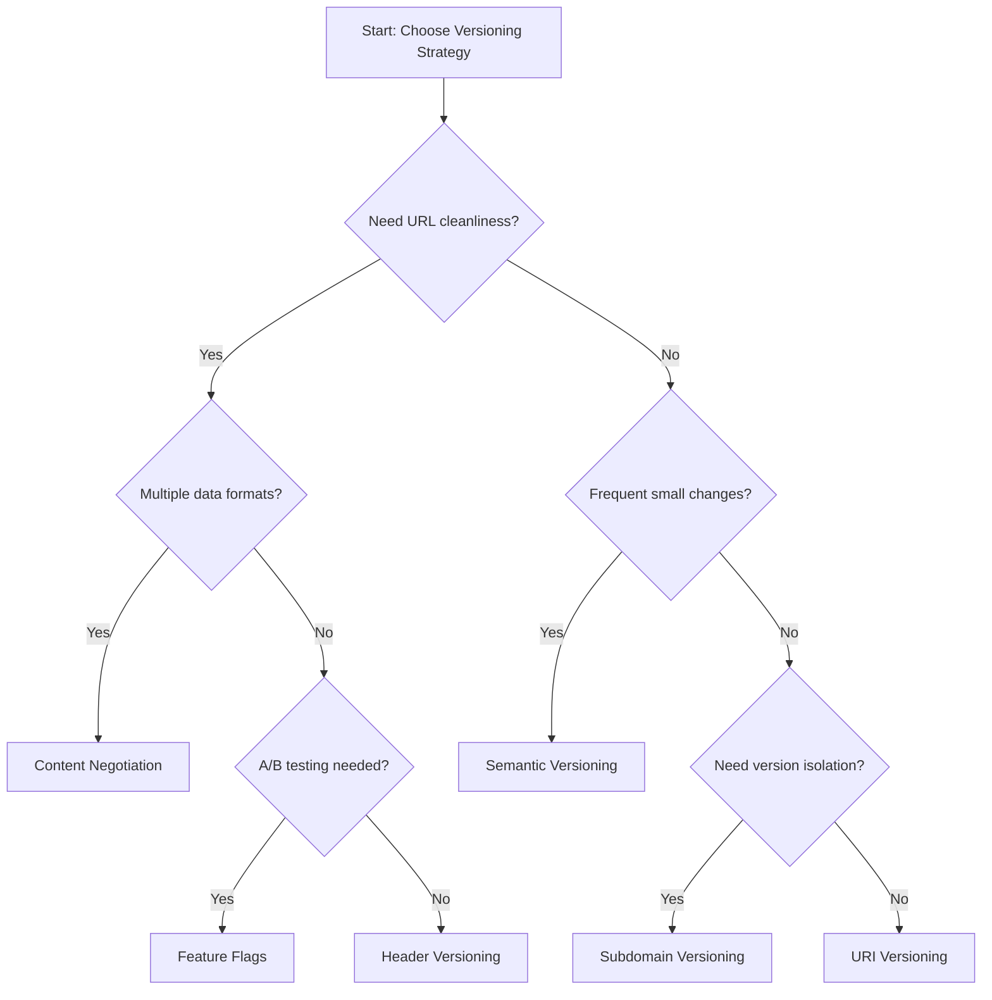

import BackToTop from "@/components/BackToTop";

# API Versioning

## Table of Contents

## Introduction

API versioning is a crucial aspect of API design that allows developers to introduce changes and improvements without breaking existing clients. This guide provides an overview of API versioning strategies, best practices, and implementation examples.

## API Versioning Strategies

API versioning can be implemented using various strategies, each with its own advantages and trade-offs. The most common strategies include:

### URI Versioning

In URI versioning, the version number is included in the URL path. This approach is straightforward and easy to understand, making it a popular choice for many APIs.

```http title="URI Versioning Example"
GET /api/v1/users
GET /api/v2/users
```

**Real-world Example: Twitter API**

```http title="Twitter API URI Versioning"
GET https://api.twitter.com/1.1/statuses/user_timeline.json
GET https://api.twitter.com/2/tweets
```

**Advantages:**

- Clear and visible versioning
- Easy to cache and route
- Simple for clients to understand

**Disadvantages:**

- Requires URL changes for new versions
- Can lead to URL proliferation

### Query Parameter Versioning

In query parameter versioning, the version number is specified as a query parameter in the request URL. This method allows for more flexibility in versioning but can lead to confusion if not documented clearly.

```http title="Query Parameter Versioning Example"
GET /api/users?version=1
GET /api/users?version=2
GET /api/users?v=1.2
GET /api/users?api_version=2023-01-15
```

**Real-world Example: Stripe API**

```http title="Stripe API Query Parameter Versioning"
GET https://api.stripe.com/v1/charges?version=2020-08-27
POST https://api.stripe.com/v1/payment_intents?api_version=2022-11-15
```

**Use Cases:**

- When you want to keep URLs clean but allow version flexibility
- For backward compatibility with existing integrations
- When supporting multiple minor versions simultaneously

**Advantages:**

- Keeps base URLs consistent
- Optional versioning (can default to latest)
- Easy to implement

**Disadvantages:**

- Can be forgotten or omitted by clients
- Caching complexity
- URL parameters can become cluttered

### Header Versioning

Header versioning involves specifying the API version in the request headers. This approach keeps the URL clean and allows for more complex versioning schemes, but it requires clients to handle custom headers.

```http title="Header Versioning Example"
GET /api/users
API-Version: v1

GET /api/users
API-Version: v2

GET /api/users
X-API-Version: 2.1.0

GET /api/users
Version: 2023-03-15
```

**Real-world Example: GitHub API**

```http title="GitHub API Header Versioning"
GET https://api.github.com/user/repos
Accept: application/vnd.github+json
X-GitHub-Api-Version: 2022-11-28
```

**Use Cases:**

- RESTful APIs that want to maintain clean URLs
- When supporting multiple versioning dimensions (API version + data format)
- Enterprise APIs with complex versioning requirements

**Advantages:**

- Clean URLs
- Can combine with content negotiation
- Flexible header naming

**Disadvantages:**

- Headers can be overlooked
- Debugging complexity
- Requires client-side header management

### Content Negotiation

Content negotiation allows clients to specify the desired version of the API through the `Accept` header.
This method is flexible and can support multiple versions simultaneously, but it requires careful management of content types.

```http title="Content Negotiation Example"
GET /api/users
Accept: application/vnd.example.v1+json

GET /api/users
Accept: application/vnd.example.v2+json

GET /api/users
Accept: application/vnd.company.api+json;version=2

GET /api/users
Accept: application/json;version=1.0
```

**Real-world Example: Salesforce API**

```http title="Salesforce API Content Negotiation"
GET https://instance.salesforce.com/services/data/v58.0/sobjects/Account
Accept: application/json

GET https://instance.salesforce.com/services/data/v59.0/sobjects/Account
Accept: application/vnd.api+json
```

**Use Cases:**

- APIs that serve multiple data formats (JSON, XML, MessagePack)
- When version affects response structure significantly
- RESTful APIs following HTTP standards strictly

**Advantages:**

- Follows HTTP standards
- Can specify both version and format
- Flexible and extensible

**Disadvantages:**

- Complex media type management
- Client library complexity
- Limited tooling support

### Semantic Versioning

Semantic versioning (SemVer) is a versioning scheme that uses a three-part version number (major.minor.patch) to indicate changes in the API. This approach provides clear expectations for clients regarding the impact of changes.

```http title="Semantic Versioning Example"
GET /api/v1.0.0/users    # Initial release
GET /api/v1.1.0/users    # New features, backward compatible
GET /api/v1.1.1/users    # Bug fixes, backward compatible
GET /api/v2.0.0/users    # Breaking changes
```

**Versioning Rules:**

- **MAJOR** version: Breaking changes that require client updates
- **MINOR** version: New features that are backward compatible
- **PATCH** version: Bug fixes that are backward compatible

**Real-world Example: Kubernetes API**

```http title="Kubernetes API Semantic Versioning"
GET /api/v1/pods                    # Stable v1
GET /apis/apps/v1/deployments       # Apps API v1
GET /apis/extensions/v1beta1/deployments  # Beta version
```

**Use Cases:**

- APIs with frequent incremental updates
- When you need to communicate change impact clearly
- Open source APIs where community adoption matters

**Advantages:**

- Clear communication of change impact
- Predictable upgrade paths
- Industry standard approach

**Disadvantages:**

- Can lead to version proliferation
- Requires discipline in change classification
- Complex URL structures

### Versioning by Feature Flags

Feature flags allow developers to enable or disable specific features in the API without changing the version. This approach provides flexibility and allows for gradual rollouts of new features.

```http title="Feature Flags Example"
GET /api/users
Feature-Flag: new-user-fields=true

GET /api/users
Feature-Flag: new-user-fields=false

GET /api/users
X-Features: pagination-v2,sorting-v3

GET /api/users?features=new-algorithm,enhanced-search
```

**Advanced Feature Flag Examples:**

```http title="Multi-Feature Management"
GET /api/products
X-Feature-Flags: search-v2=true,recommendations=false,pricing-v3=true

POST /api/orders
Feature-Toggles: payment-gateway-v2,inventory-realtime,shipping-calculator-v3
Content-Type: application/json
{
  "user_id": 123,
  "items": [...]
}
```

**Real-world Example: LaunchDarkly API**

```javascript title="Client-side Feature Flag Usage"
// JavaScript SDK
const showNewFeature = ldClient.variation("new-api-endpoint", false);
if (showNewFeature) {
  fetch("/api/v2/users");
} else {
  fetch("/api/v1/users");
}
```

**Use Cases:**

- A/B testing new API features
- Gradual rollout of breaking changes
- Emergency feature disable without deployment
- Customer-specific feature access

**Advantages:**

- Runtime feature control
- No version proliferation
- Easy rollback mechanism
- Granular feature management

**Disadvantages:**

- Added complexity in API logic
- Potential performance overhead
- Debugging complexity with multiple flag combinations

### Versioning by Subdomains

Subdomain versioning involves using different subdomains for different API versions. This approach can help isolate versions and provide clear separation between them.

```http title="Subdomain Versioning Example"
GET https://v1.api.example.com/users
GET https://v2.api.example.com/users
GET https://api-v3.example.com/users
GET https://legacy.api.example.com/users
```

**Real-world Example: AWS Services**

```http title="AWS API Subdomain Versioning"
GET https://ec2.amazonaws.com/         # EC2 Classic
GET https://ec2.us-east-1.amazonaws.com/  # Regional endpoints
GET https://s3.amazonaws.com/bucket/object  # S3 global
GET https://s3-us-west-2.amazonaws.com/bucket/object  # S3 regional
```

**Advanced Subdomain Strategies:**

```http title="Environment + Version Subdomains"
GET https://v1.api.staging.example.com/users
GET https://v2.api.production.example.com/users
GET https://beta.api.example.com/users
GET https://canary.api.example.com/users
```

**Use Cases:**

- Complete isolation between API versions
- Different infrastructure for different versions
- Legacy system separation
- Geographic or regional API distribution

**Advantages:**

- Complete version isolation
- Easy to route traffic
- Clear separation of concerns
- Independent scaling per version

**Disadvantages:**

- DNS management complexity
- SSL certificate management
- Infrastructure overhead
- Cross-origin issues in web applications

### Versioning by Media Type

Media type versioning uses the `Accept` header to specify the desired version of the API based on the media type. This method allows for fine-grained control over the API response format.

```http title="Media Type Versioning Example"
GET /api/users
Accept: application/vnd.example.v1+json

GET /api/users
Accept: application/vnd.example.v2+json

GET /api/users
Accept: application/vnd.company.user.v3+xml

GET /api/users
Accept: application/vnd.api+json;version=2.1
```

**Real-world Example: GitHub API**

```http title="GitHub API Media Type Versioning"
GET https://api.github.com/user
Accept: application/vnd.github.v3+json

GET https://api.github.com/user
Accept: application/vnd.github.raw+json

GET https://api.github.com/user
Accept: application/vnd.github.v3.star+json
```

**Advanced Media Type Examples:**

```http title="Complex Media Type Versioning"
# Version + Format + Features
GET /api/products
Accept: application/vnd.ecommerce.product.v2+json;charset=utf-8;features=pricing,inventory

# Multiple Accept Headers
GET /api/users
Accept: application/vnd.company.v2+json, application/vnd.company.v1+json;q=0.8, application/json;q=0.5
```

**Use Cases:**

- APIs that serve multiple data formats
- When response structure varies significantly between versions
- Fine-grained control over API features and format
- APIs following strict REST principles

**Advantages:**

- Follows HTTP content negotiation standards
- Can specify both version and format preferences
- Supports quality values for preference ordering
- Flexible feature negotiation

**Disadvantages:**

- Complex media type management
- Limited client library support
- Debugging difficulty
- MIME type registration considerations

<BackToTop />
## Choosing the Right Versioning Strategy

### Decision Matrix

| Strategy            | Complexity | URL Cleanliness | Caching | Client Support | Use Case                              |
| ------------------- | ---------- | --------------- | ------- | -------------- | ------------------------------------- |
| URI Versioning      | Low        | Medium          | Easy    | Excellent      | Most APIs, clear versioning needs     |
| Query Parameter     | Low        | High            | Medium  | Good           | Backward compatibility focus          |
| Header Versioning   | Medium     | High            | Hard    | Good           | RESTful APIs, clean URLs              |
| Content Negotiation | High       | High            | Hard    | Medium         | Multi-format APIs                     |
| Semantic Versioning | Medium     | Medium          | Easy    | Good           | Frequent updates, clear communication |
| Feature Flags       | High       | High            | Hard    | Medium         | A/B testing, gradual rollouts         |
| Subdomain           | Medium     | Medium          | Easy    | Good           | Version isolation, microservices      |
| Media Type          | High       | High            | Hard    | Poor           | Strict REST compliance                |

### Decision Tree



### Hybrid Approaches

Many successful APIs combine multiple strategies:

```http title="Hybrid Strategy Example"
# Major versions in URI + minor versions in headers
GET /api/v2/users
API-Version: 2.3
Feature-Flags: enhanced-search=true

# Subdomain + semantic versioning
GET https://v2.api.example.com/users
Accept: application/vnd.company.v2.1+json
```

<BackToTop />
## Implementation Patterns

### 1. The Adapter Pattern

Use adapters to maintain multiple API versions with a single codebase:

```javascript title="Version Adapter Pattern"
class UserController {
  async getUsers(req, res) {
    const users = await this.userService.getUsers();
    const version = this.getApiVersion(req);

    // Use adapter to transform response based on version
    const adapter = VersionAdapterFactory.create(version);
    const transformedUsers = adapter.transformUsers(users);

    res.json(transformedUsers);
  }
}

class V1UserAdapter {
  transformUsers(users) {
    return users.map((user) => ({
      id: user.id,
      name: user.fullName, // v1 uses 'name'
      email: user.email,
      created: user.createdAt, // v1 uses 'created'
    }));
  }
}

class V2UserAdapter {
  transformUsers(users) {
    return users.map((user) => ({
      id: user.id,
      full_name: user.fullName, // v2 uses 'full_name'
      email: user.email,
      avatar_url: user.avatarUrl, // v2 adds avatar
      created_at: user.createdAt, // v2 uses 'created_at'
    }));
  }
}
```

### 2. The Proxy Pattern

Route requests to different service implementations:

```javascript title="Version Proxy Pattern"
class APIGateway {
  async routeRequest(req, res) {
    const version = this.extractVersion(req);

    switch (version) {
      case "v1":
        return this.v1Service.handleRequest(req, res);
      case "v2":
        return this.v2Service.handleRequest(req, res);
      case "v3":
        return this.v3Service.handleRequest(req, res);
      default:
        return this.latestService.handleRequest(req, res);
    }
  }
}
```

### 3. The Decorator Pattern

Add version-specific behavior to base implementations:

```javascript title="Version Decorator Pattern"
class BaseUserService {
  async getUser(id) {
    return await this.repository.findById(id);
  }
}

class V2UserServiceDecorator extends BaseUserService {
  async getUser(id) {
    const user = await super.getUser(id);

    // V2 specific enhancements
    user.avatar_url = await this.avatarService.getAvatarUrl(user.id);
    user.preferences = await this.preferencesService.getPreferences(user.id);

    return user;
  }
}
```

<BackToTop />
## Advanced Topics

### Version Sunset Automation

Automate the deprecation process:

```javascript title="Automated Sunset Process"
class VersionManager {
  constructor() {
    this.versionConfig = {
      v1: {
        sunsetDate: new Date("2024-12-31"),
        warningPhases: [90, 60, 30, 7], // days before sunset
        status: "deprecated",
      },
      v2: {
        sunsetDate: null,
        status: "active",
      },
    };
  }

  checkDeprecationStatus(version) {
    const config = this.versionConfig[version];
    if (!config || !config.sunsetDate) return null;

    const daysUntilSunset = this.getDaysUntil(config.sunsetDate);

    if (daysUntilSunset <= 0) {
      throw new Error(`API ${version} has been retired`);
    }

    if (config.warningPhases.includes(daysUntilSunset)) {
      return {
        warning: true,
        message: `API ${version} will be retired in ${daysUntilSunset} days`,
        migrationUrl: `https://docs.example.com/migrate-${version}`,
      };
    }

    return null;
  }
}
```

### Contract Testing for Versions

Ensure version compatibility with contract testing:

```javascript title="Contract Testing Example"
describe("API Contract Tests", () => {
  const versions = ["v1", "v2"];

  versions.forEach((version) => {
    describe(`API ${version}`, () => {
      test("should maintain user schema contract", async () => {
        const response = await request(`/api/${version}/users/1`);
        const schema = await loadSchema(`user-${version}.json`);

        expect(response.body).toMatchSchema(schema);
      });

      test("should maintain error response format", async () => {
        const response = await request(`/api/${version}/users/999`);
        const errorSchema = await loadSchema(`error-${version}.json`);

        expect(response.body).toMatchSchema(errorSchema);
      });
    });
  });
});
```

<BackToTop />

## Summary and Recommendations

### Quick Start Checklist

For new APIs, follow this checklist:

1. **Choose Your Strategy**
   - ✅ Start with URI versioning for simplicity
   - ✅ Use semantic versioning for clear communication
   - ✅ Consider feature flags for gradual rollouts

2. **Set Up Infrastructure**
   - ✅ Implement version detection and routing
   - ✅ Set up monitoring and analytics
   - ✅ Create automated testing for each version

3. **Plan for the Future**
   - ✅ Define deprecation policies
   - ✅ Create migration guide templates
   - ✅ Establish version support lifecycle

4. **Document Everything**
   - ✅ Version-specific API documentation
   - ✅ Change logs and migration guides
   - ✅ Client integration examples

### Industry Standards by API Type

| API Type       | Recommended Strategy      | Examples                     |
| -------------- | ------------------------- | ---------------------------- |
| REST APIs      | URI + Semantic Versioning | `/api/v1.2/users`            |
| GraphQL APIs   | Schema Versioning         | `@deprecated` directives     |
| gRPC APIs      | Package Versioning        | `package api.v1`             |
| WebSocket APIs | Protocol Versioning       | `Sec-WebSocket-Protocol: v2` |

### Final Recommendations

1. **Start Simple**: Begin with URI versioning and evolve as needed
2. **Plan Ahead**: Design your versioning strategy before your first API release
3. **Communicate Early**: Give clients plenty of notice about changes and deprecations
4. **Test Thoroughly**: Ensure each version works correctly and maintains backward compatibility where promised
5. **Monitor Actively**: Track version usage and performance to inform future decisions

Remember: The best versioning strategy is the one that serves your clients effectively while allowing your API to evolve. Choose simplicity over complexity, and always prioritize developer experience.

<BackToTop />
