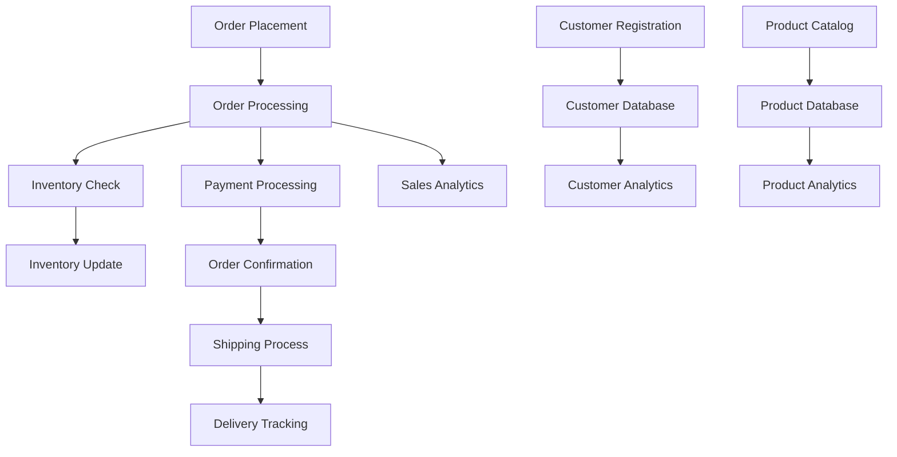

import BackToTop from "@/components/BackToTop";

# Database Design Fundamentals

## Table of Contents

## Introduction to Database Design

Database design is a foundational discipline in software development, focused on creating a systematic and logical structure for storing, retrieving, and managing data. Its primary goal is to ensure that data is organized in a way that supports the application's functional requirements, maintains data integrity, and enables efficient access and modification. A thoughtfully designed database not only improves application performance and scalability but also simplifies future maintenance and adaptation to changing business needs.

At its core, database design involves much more than simply defining tables and columns. It requires a deep understanding of the data domain, the relationships between different entities, and the specific ways in which the application will interact with the data. Effective database design balances several key objectives:

- **Data Integrity**: Ensuring that the data remains accurate, consistent, and reliable throughout its lifecycle.
- **Efficiency**: Structuring data to optimize for common queries and operations, minimizing redundancy, and supporting fast access.
- **Scalability**: Designing the database to handle growth in data volume and user activity without significant performance degradation.
- **Maintainability**: Creating a structure that is easy to understand, modify, and extend as requirements evolve.

The database design process typically unfolds in several stages:

- **Requirements Analysis**: Gathering and analyzing the data needs of the application and its users. This step involves identifying what information must be stored, how it will be used, and any constraints or rules that must be enforced.
- **Conceptual Design**: Developing a high-level, abstract model of the data using tools like Entity-Relationship Diagrams (ERDs). This model captures the main entities, their attributes, and the relationships between them, independent of any specific database technology.
- **Logical Design**: Translating the conceptual model into a logical schema that defines tables, fields, data types, and relationships. This stage also involves applying normalization principles to reduce redundancy and ensure data consistency.
- **Physical Design**: Implementing the logical schema in a specific database management system (DBMS). This includes choosing storage structures, indexing strategies, and configuring performance optimizations based on the expected workload.

Throughout these stages, designers must make informed decisions about normalization (to minimize data duplication and maintain integrity) and, where appropriate, denormalization (to improve read performance for specific use cases). The result is a robust, flexible, and efficient database structure that serves as the backbone of the application.

Understanding and applying these principles is essential for building robust, scalable, and maintainable databases. In the following sections, we will explore data modeling, normalization, relationships, and schema design in depth.

## Database Design Process

The database design process is a systematic approach to creating efficient and effective database structures. This methodical process ensures that the final database meets all requirements while maintaining optimal performance and scalability.

### Phase 1: Planning and Analysis

Before any design work begins, it's crucial to understand the business context and requirements:

- **Stakeholder Identification**: Identify all parties who will interact with the database, including end users, administrators, and developers
- **Business Rules Discovery**: Document all business rules that will govern data storage and manipulation
- **Scope Definition**: Clearly define what the database will and will not include
- **Success Criteria**: Establish measurable goals for performance, reliability, and functionality

### Phase 2: Requirements Gathering

This phase involves collecting detailed information about data needs:

#### Functional Requirements

- What data needs to be stored?
- How will data be accessed and modified?
- What reports and analytics are needed?
- What are the data entry workflows?

#### Non-Functional Requirements

- **Performance**: Response time expectations, throughput requirements
- **Scalability**: Expected data growth, user load projections
- **Availability**: Uptime requirements, disaster recovery needs
- **Security**: Data sensitivity, access control requirements
- **Compliance**: Regulatory requirements (GDPR, HIPAA, SOX, etc.)

### Phase 3: Conceptual Design

Create a high-level, technology-independent model:

```
Business Requirements → Conceptual Model
```

#### Entity Identification

Identify the main business objects or concepts that need to be stored:

```
Example: E-commerce System
- Customer (person who makes purchases)
- Product (items for sale)
- Order (purchase transaction)
- Category (product groupings)
- Supplier (product vendors)
- Payment (financial transactions)
```

#### Relationship Mapping

Define how entities relate to each other:

```
Customer ──── Places ──── Order
   │                        │
   │                        │
   └── Prefers ──── Category │
                             │
Product ──── Belongs to ─────┘
   │
   │
Supplier ──── Supplies ──────┘
```

### Phase 4: Logical Design

Transform the conceptual model into a logical database schema:

#### Table Definition

```sql
-- Customer table structure
CREATE TABLE customers (
    customer_id SERIAL PRIMARY KEY,
    first_name VARCHAR(50) NOT NULL,
    last_name VARCHAR(50) NOT NULL,
    email VARCHAR(100) UNIQUE NOT NULL,
    phone VARCHAR(20),
    date_created TIMESTAMP DEFAULT CURRENT_TIMESTAMP,
    is_active BOOLEAN DEFAULT TRUE
);

-- Order table structure
CREATE TABLE orders (
    order_id SERIAL PRIMARY KEY,
    customer_id INTEGER REFERENCES customers(customer_id),
    order_date TIMESTAMP DEFAULT CURRENT_TIMESTAMP,
    status VARCHAR(20) DEFAULT 'pending',
    total_amount DECIMAL(10,2) NOT NULL,
    shipping_address TEXT,
    billing_address TEXT
);
```

#### Normalization Application

Apply normal forms to eliminate redundancy:

```sql
-- Before normalization (problematic design)
CREATE TABLE order_items_bad (
    order_id INTEGER,
    customer_name VARCHAR(100),  -- Redundant
    customer_email VARCHAR(100), -- Redundant
    product_name VARCHAR(100),
    product_price DECIMAL(10,2),
    quantity INTEGER
);

-- After normalization (improved design)
CREATE TABLE order_items (
    order_item_id SERIAL PRIMARY KEY,
    order_id INTEGER REFERENCES orders(order_id),
    product_id INTEGER REFERENCES products(product_id),
    quantity INTEGER NOT NULL,
    unit_price DECIMAL(10,2) NOT NULL
);
```

### Phase 5: Physical Design

Implement the logical design in a specific DBMS:

#### Storage Optimization

```sql
-- Indexing strategy
CREATE INDEX idx_customers_email ON customers(email);
CREATE INDEX idx_orders_customer_id ON orders(customer_id);
CREATE INDEX idx_orders_date ON orders(order_date);
CREATE INDEX idx_order_items_order_id ON order_items(order_id);

-- Partitioning for large tables
CREATE TABLE orders_2024 PARTITION OF orders
FOR VALUES FROM ('2024-01-01') TO ('2025-01-01');
```

#### Performance Tuning

```sql
-- Materialized views for complex queries
CREATE MATERIALIZED VIEW customer_order_summary AS
SELECT
    c.customer_id,
    c.first_name,
    c.last_name,
    COUNT(o.order_id) as total_orders,
    SUM(o.total_amount) as total_spent,
    MAX(o.order_date) as last_order_date
FROM customers c
LEFT JOIN orders o ON c.customer_id = o.customer_id
GROUP BY c.customer_id, c.first_name, c.last_name;
```

## Key Concepts in Database Design

- **Data Modeling**: This is the foundational process of defining and organizing the data elements and their relationships within a system. Data modeling involves identifying entities (such as users, products, or orders), their attributes (like name, price, or date), and the relationships between them. Visual tools like Entity-Relationship Diagrams (ERDs) are commonly used to represent these structures, making it easier to communicate and validate the design with stakeholders.

- **Normalization**: Normalization is a systematic approach to organizing data in a database to reduce redundancy and improve data integrity. It involves decomposing large, complex tables into smaller, related tables and establishing clear relationships between them. The process follows a series of normal forms, each with specific rules that help eliminate duplicate data and ensure logical data dependencies.

- **Relationships**: Defining relationships is essential for illustrating how different entities in the database interact with each other. Relationships can be one-to-one, one-to-many, or many-to-many, and they determine how data in one table is associated with data in another. Properly modeling relationships ensures that the database accurately reflects real-world interactions and supports complex queries and operations.

- **Schema Design**: Schema design is the process of creating the blueprint for the database structure. It specifies the tables, fields, data types, indexes, and constraints that govern how data is stored, accessed, and maintained. A well-designed schema supports application requirements, enforces data integrity, and enables efficient data retrieval and updates.

<BackToTop />
## Entity-Relationship Modeling

Entity-Relationship (ER) modeling is a systematic approach to designing databases that focuses on identifying entities, their attributes, and the relationships between them. This methodology provides a clear, visual representation of the database structure that can be easily understood by both technical and non-technical stakeholders.

### Entities and Attributes

#### Entity Types

An entity represents a real-world object or concept that has independent existence and can be uniquely identified:

**Strong Entities**: Independent entities that can exist without other entities

```
Customer Entity:
- customer_id (Primary Key)
- first_name
- last_name
- email
- phone_number
- registration_date
```

**Weak Entities**: Entities that depend on other entities for their existence

```
Order_Item Entity (depends on Order):
- order_id (Foreign Key)
- item_sequence (Partial Key)
- product_id (Foreign Key)
- quantity
- unit_price
```

#### Attribute Categories

##### Simple vs. Composite Attributes

```sql
-- Simple attribute
first_name VARCHAR(50)

-- Composite attribute (can be broken down)
-- Instead of: full_address TEXT
-- Use separate components:
street_address VARCHAR(100),
city VARCHAR(50),
state VARCHAR(2),
postal_code VARCHAR(10),
country VARCHAR(50)
```

##### Single-valued vs. Multi-valued Attributes

```sql
-- Single-valued attribute
email VARCHAR(100)

-- Multi-valued attribute (requires separate table)
CREATE TABLE customer_phone_numbers (
    customer_id INTEGER REFERENCES customers(customer_id),
    phone_number VARCHAR(20),
    phone_type VARCHAR(20), -- 'mobile', 'home', 'work'
    PRIMARY KEY (customer_id, phone_number)
);
```

##### Stored vs. Derived Attributes

```sql
-- Stored attributes
birth_date DATE,
order_date TIMESTAMP,
unit_price DECIMAL(10,2),
quantity INTEGER

-- Derived attributes (calculated)
age AS (EXTRACT(YEAR FROM AGE(birth_date))),
line_total AS (unit_price * quantity)
```

### Relationship Types and Cardinality

#### One-to-One (1:1) Relationships

```sql
-- Employee to Employee_Details relationship
CREATE TABLE employees (
    employee_id SERIAL PRIMARY KEY,
    employee_number VARCHAR(20) UNIQUE,
    first_name VARCHAR(50),
    last_name VARCHAR(50)
);

CREATE TABLE employee_details (
    employee_id INTEGER PRIMARY KEY REFERENCES employees(employee_id),
    social_security VARCHAR(11),
    emergency_contact VARCHAR(100),
    medical_info TEXT
);
```

#### One-to-Many (1:N) Relationships

```sql
-- Customer to Orders relationship
CREATE TABLE customers (
    customer_id SERIAL PRIMARY KEY,
    customer_name VARCHAR(100)
);

CREATE TABLE orders (
    order_id SERIAL PRIMARY KEY,
    customer_id INTEGER REFERENCES customers(customer_id),
    order_date TIMESTAMP
);
```

#### Many-to-Many (M:N) Relationships

```sql
-- Students to Courses relationship (requires junction table)
CREATE TABLE students (
    student_id SERIAL PRIMARY KEY,
    student_name VARCHAR(100)
);

CREATE TABLE courses (
    course_id SERIAL PRIMARY KEY,
    course_name VARCHAR(100)
);

CREATE TABLE enrollments (
    student_id INTEGER REFERENCES students(student_id),
    course_id INTEGER REFERENCES courses(course_id),
    enrollment_date DATE,
    grade VARCHAR(2),
    PRIMARY KEY (student_id, course_id)
);
```

### Advanced Relationship Concepts

#### Recursive Relationships

```sql
-- Employee management hierarchy
CREATE TABLE employees (
    employee_id SERIAL PRIMARY KEY,
    employee_name VARCHAR(100),
    manager_id INTEGER REFERENCES employees(employee_id),
    department VARCHAR(50)
);

-- Query to find all direct reports
SELECT e.employee_name as employee, m.employee_name as manager
FROM employees e
LEFT JOIN employees m ON e.manager_id = m.employee_id;
```

#### Ternary Relationships

```sql
-- Supplier-Product-Project relationship
CREATE TABLE supplier_product_project (
    supplier_id INTEGER REFERENCES suppliers(supplier_id),
    product_id INTEGER REFERENCES products(product_id),
    project_id INTEGER REFERENCES projects(project_id),
    quantity_supplied INTEGER,
    supply_date DATE,
    unit_cost DECIMAL(10,2),
    PRIMARY KEY (supplier_id, product_id, project_id)
);
```

<BackToTop />
## Database Design Principles

### ACID Properties

Database design must ensure ACID compliance for reliable transactions:

#### Atomicity

```sql
-- Transaction example: Transfer money between accounts
BEGIN TRANSACTION;

UPDATE accounts
SET balance = balance - 100
WHERE account_id = 'ACC001';

UPDATE accounts
SET balance = balance + 100
WHERE account_id = 'ACC002';

-- Either both updates succeed or both fail
COMMIT; -- or ROLLBACK on error
```

#### Consistency

```sql
-- Enforce business rules through constraints
ALTER TABLE accounts
ADD CONSTRAINT check_positive_balance
CHECK (balance >= 0);

-- Triggers for complex consistency rules
CREATE OR REPLACE FUNCTION update_account_last_modified()
RETURNS TRIGGER AS $$
BEGIN
    NEW.last_modified = CURRENT_TIMESTAMP;
    RETURN NEW;
END;
$$ LANGUAGE plpgsql;

CREATE TRIGGER account_update_trigger
    BEFORE UPDATE ON accounts
    FOR EACH ROW
    EXECUTE FUNCTION update_account_last_modified();
```

#### Isolation

```sql
-- Set appropriate isolation levels
SET TRANSACTION ISOLATION LEVEL READ COMMITTED;
-- or
SET TRANSACTION ISOLATION LEVEL SERIALIZABLE;
```

#### Durability

```sql
-- Configure write-ahead logging and synchronous commits
-- In postgresql.conf:
-- wal_level = replica
-- synchronous_commit = on
-- fsync = on
```

### Data Integrity Principles

#### Entity Integrity

```sql
-- Every table must have a primary key
CREATE TABLE products (
    product_id SERIAL PRIMARY KEY,  -- Ensures entity integrity
    product_name VARCHAR(100) NOT NULL,
    price DECIMAL(10,2) NOT NULL
);
```

#### Referential Integrity

```sql
-- Foreign key constraints ensure referential integrity
CREATE TABLE order_items (
    order_item_id SERIAL PRIMARY KEY,
    order_id INTEGER NOT NULL REFERENCES orders(order_id) ON DELETE CASCADE,
    product_id INTEGER NOT NULL REFERENCES products(product_id) ON DELETE RESTRICT,
    quantity INTEGER NOT NULL CHECK (quantity > 0)
);
```

#### Domain Integrity

```sql
-- Data type and constraint-based domain integrity
CREATE TABLE customers (
    customer_id SERIAL PRIMARY KEY,
    email VARCHAR(100) NOT NULL CHECK (email ~* '^[A-Za-z0-9._%+-]+@[A-Za-z0-9.-]+\.[A-Z|a-z]{2,}$'),
    age INTEGER CHECK (age >= 0 AND age <= 150),
    status VARCHAR(20) CHECK (status IN ('active', 'inactive', 'suspended')),
    created_at TIMESTAMP DEFAULT CURRENT_TIMESTAMP
);
```

### Design for Scalability

#### Horizontal Scaling Considerations

```sql
-- Design for sharding: include shard key in primary key
CREATE TABLE user_activities (
    user_id INTEGER,
    activity_id BIGSERIAL,
    activity_type VARCHAR(50),
    activity_date TIMESTAMP,
    PRIMARY KEY (user_id, activity_id)  -- Composite key supports sharding by user_id
);
```

#### Vertical Scaling Optimization

```sql
-- Separate frequently and infrequently accessed data
CREATE TABLE users_core (
    user_id SERIAL PRIMARY KEY,
    username VARCHAR(50) UNIQUE,
    email VARCHAR(100) UNIQUE,
    password_hash VARCHAR(255),
    created_at TIMESTAMP
);

CREATE TABLE users_profile (
    user_id INTEGER PRIMARY KEY REFERENCES users_core(user_id),
    first_name VARCHAR(50),
    last_name VARCHAR(50),
    bio TEXT,
    profile_image_url VARCHAR(255),
    last_login TIMESTAMP
);

CREATE TABLE users_preferences (
    user_id INTEGER PRIMARY KEY REFERENCES users_core(user_id),
    theme VARCHAR(20) DEFAULT 'light',
    language VARCHAR(10) DEFAULT 'en',
    timezone VARCHAR(50) DEFAULT 'UTC',
    notifications_enabled BOOLEAN DEFAULT TRUE
);
```

<BackToTop />
## Types of Database Models

### Relational Model

The most common model for transactional systems:

```sql
-- Traditional relational design for e-commerce
CREATE TABLE categories (
    category_id SERIAL PRIMARY KEY,
    category_name VARCHAR(100) UNIQUE NOT NULL,
    parent_category_id INTEGER REFERENCES categories(category_id)
);

CREATE TABLE products (
    product_id SERIAL PRIMARY KEY,
    category_id INTEGER REFERENCES categories(category_id),
    product_name VARCHAR(200) NOT NULL,
    description TEXT,
    price DECIMAL(10,2) NOT NULL,
    stock_quantity INTEGER DEFAULT 0
);

CREATE TABLE customers (
    customer_id SERIAL PRIMARY KEY,
    email VARCHAR(100) UNIQUE NOT NULL,
    first_name VARCHAR(50),
    last_name VARCHAR(50)
);

CREATE TABLE orders (
    order_id SERIAL PRIMARY KEY,
    customer_id INTEGER REFERENCES customers(customer_id),
    order_date TIMESTAMP DEFAULT CURRENT_TIMESTAMP,
    status VARCHAR(20) DEFAULT 'pending'
);

CREATE TABLE order_items (
    order_id INTEGER REFERENCES orders(order_id),
    product_id INTEGER REFERENCES products(product_id),
    quantity INTEGER NOT NULL,
    unit_price DECIMAL(10,2) NOT NULL,
    PRIMARY KEY (order_id, product_id)
);
```

### Document Model

For semi-structured data and flexible schemas:

```javascript
// MongoDB document design
// Customer document
{
  "_id": ObjectId("..."),
  "email": "customer@example.com",
  "profile": {
    "firstName": "John",
    "lastName": "Doe",
    "addresses": [
      {
        "type": "shipping",
        "street": "123 Main St",
        "city": "Anytown",
        "state": "CA",
        "zipCode": "12345"
      },
      {
        "type": "billing",
        "street": "456 Oak Ave",
        "city": "Othercity",
        "state": "NY",
        "zipCode": "67890"
      }
    ]
  },
  "preferences": {
    "newsletter": true,
    "smsNotifications": false,
    "preferredCategories": ["electronics", "books"]
  },
  "orderHistory": [
    {
      "orderId": "ORD-001",
      "date": ISODate("2024-01-15"),
      "total": 299.99,
      "status": "delivered"
    }
  ]
}

// Product document with embedded reviews
{
  "_id": ObjectId("..."),
  "sku": "PROD-12345",
  "name": "Wireless Headphones",
  "category": "electronics",
  "price": 199.99,
  "inventory": {
    "quantity": 50,
    "warehouse": "WH-001",
    "lastRestocked": ISODate("2024-01-10")
  },
  "reviews": [
    {
      "customerId": ObjectId("..."),
      "rating": 5,
      "comment": "Excellent sound quality!",
      "date": ISODate("2024-01-20"),
      "verified": true
    }
  ],
  "tags": ["bluetooth", "noise-canceling", "portable"]
}
```

### Graph Model

For highly connected data:

```cypher
// Neo4j graph model for social network
// Create users
CREATE (alice:User {id: 1, name: 'Alice', email: 'alice@example.com'})
CREATE (bob:User {id: 2, name: 'Bob', email: 'bob@example.com'})
CREATE (charlie:User {id: 3, name: 'Charlie', email: 'charlie@example.com'})

// Create relationships
CREATE (alice)-[:FOLLOWS {since: '2024-01-01'}]->(bob)
CREATE (bob)-[:FOLLOWS {since: '2024-01-02'}]->(charlie)
CREATE (alice)-[:LIKES {timestamp: '2024-01-15T10:30:00Z'}]->(post1)

// Create content
CREATE (post1:Post {id: 101, content: 'Great weather today!', timestamp: '2024-01-15T09:00:00Z'})
CREATE (bob)-[:AUTHORED]->(post1)

// Query: Find mutual friends
MATCH (user1:User)-[:FOLLOWS]->(mutual:User)<-[:FOLLOWS]-(user2:User)
WHERE user1.name = 'Alice' AND user2.name = 'Charlie'
RETURN mutual.name AS mutualFriend
```

### Hybrid Models

Combining different models for optimal performance:

```sql
-- PostgreSQL with JSONB for hybrid relational-document model
CREATE TABLE products (
    product_id SERIAL PRIMARY KEY,
    sku VARCHAR(50) UNIQUE NOT NULL,
    name VARCHAR(200) NOT NULL,
    category_id INTEGER REFERENCES categories(category_id),
    base_price DECIMAL(10,2) NOT NULL,

    -- JSON attributes for flexible data
    attributes JSONB,
    metadata JSONB,

    created_at TIMESTAMP DEFAULT CURRENT_TIMESTAMP,
    updated_at TIMESTAMP DEFAULT CURRENT_TIMESTAMP
);

-- Create indexes on JSONB fields
CREATE INDEX idx_products_attributes_brand ON products USING GIN ((attributes->>'brand'));
CREATE INDEX idx_products_attributes_color ON products USING GIN ((attributes->>'color'));

-- Insert product with JSON attributes
INSERT INTO products (sku, name, category_id, base_price, attributes, metadata)
VALUES (
    'LAPTOP-001',
    'Gaming Laptop',
    1,
    1299.99,
    '{
        "brand": "TechCorp",
        "model": "GameMaster Pro",
        "specs": {
            "cpu": "Intel i7-11800H",
            "ram": "16GB DDR4",
            "storage": "512GB SSD",
            "graphics": "RTX 3070"
        },
        "features": ["backlit keyboard", "high refresh display", "advanced cooling"]
    }',
    '{
        "supplier": "TechCorp Direct",
        "warranty": "2 years",
        "certifications": ["Energy Star", "EPEAT Gold"]
    }'
);

-- Query products by JSON attributes
SELECT product_id, name, attributes->>'brand' as brand
FROM products
WHERE attributes->>'brand' = 'TechCorp'
AND (attributes->'specs'->>'ram')::text LIKE '%16GB%';
```

<BackToTop />

## Requirements Analysis

### Stakeholder Analysis

#### Identifying Key Stakeholders

```markdown
## Stakeholder Matrix

### Primary Stakeholders (Direct Users)

- **End Users**: Customers using the application
- **System Administrators**: Managing the database and infrastructure
- **Application Developers**: Building features that interact with the database
- **Data Analysts**: Running reports and analytics

### Secondary Stakeholders (Indirect Impact)

- **Business Owners**: Define requirements and success metrics
- **Compliance Officers**: Ensure regulatory adherence
- **Security Team**: Define security requirements
- **Performance Engineers**: Optimize system performance

### External Stakeholders

- **Third-party Integrations**: APIs and services that connect to the system
- **Auditors**: External compliance verification
- **Regulatory Bodies**: Government or industry oversight
```

<BackToTop />
#### Requirements Gathering Techniques

##### User Interviews

```markdown
## Interview Template: E-commerce Database Requirements

### Customer Management

1. What customer information do you need to store?
2. How do customers typically interact with your system?
3. What customer data is required vs. optional?
4. How do you handle customer privacy and data retention?

### Order Processing

1. Describe the complete order lifecycle
2. What happens when orders are modified or cancelled?
3. How do you handle partial shipments?
4. What reporting do you need on orders?

### Inventory Management

1. How do you track product availability?
2. Do you need to support variants (size, color, etc.)?
3. How do you handle stock reservations?
4. What integrations with suppliers do you need?
```

##### Data Flow Analysis



<BackToTop />

### Functional Requirements Documentation

#### User Stories Format

```markdown
## User Story: Customer Registration

**As a** new customer

**I want to** create an account with my email and password

**So that** I can place orders and track my purchase history

### Acceptance Criteria

- [ ] Customer must provide valid email address
- [ ] Password must meet security requirements (8+ chars, mixed case, numbers)
- [ ] Email verification required before account activation
- [ ] Duplicate email addresses not allowed
- [ ] Customer can optionally provide profile information during registration

### Data Requirements

- Email (required, unique, validated)
- Password (hashed, complexity requirements)
- First Name (optional)
- Last Name (optional)
- Phone Number (optional, formatted)
- Registration Date (auto-generated)
- Email Verification Status (boolean)
- Account Status (active/inactive/suspended)
```

#### Business Rules Documentation

```markdown
## Business Rules: Order Management

### Order Creation Rules

1. **BR-001**: Orders can only be created by authenticated customers
2. **BR-002**: Orders must contain at least one product
3. **BR-003**: Order total must be greater than $0
4. **BR-004**: Stock must be available for all ordered items
5. **BR-005**: Customer address must be validated before order confirmation

### Order Modification Rules

1. **BR-010**: Orders can be modified within 30 minutes of creation
2. **BR-011**: Shipped orders cannot be modified
3. **BR-012**: Order modifications that increase total require payment authorization
4. **BR-013**: Order cancellations within 24 hours receive full refund

### Inventory Rules

1. **BR-020**: Stock is reserved upon order creation
2. **BR-021**: Reserved stock is released if order is not paid within 30 minutes
3. **BR-022**: Back-ordered items can be ordered if customer opts in
4. **BR-023**: Low stock alerts triggered when quantity < 10
```

<BackToTop />

### Non-Functional Requirements

#### Performance Requirements

```sql
-- Performance benchmarks and constraints
/*
Performance Requirements:

1. Response Time Requirements:
   - User login: < 500ms (95th percentile)
   - Product search: < 1 second (95th percentile)
   - Order creation: < 2 seconds (95th percentile)
   - Report generation: < 30 seconds

2. Throughput Requirements:
   - Concurrent users: 10,000 peak
   - Orders per hour: 5,000 peak
   - Product searches per second: 1,000 peak

3. Availability Requirements:
   - System uptime: 99.9% (8.76 hours downtime per year)
   - Planned maintenance windows: < 4 hours per month
   - Recovery time objective (RTO): 4 hours
   - Recovery point objective (RPO): 1 hour
*/

-- Database design decisions based on performance requirements
CREATE TABLE products (
    product_id SERIAL PRIMARY KEY,
    name VARCHAR(200) NOT NULL,
    category_id INTEGER,
    price DECIMAL(10,2),

    -- Denormalized fields for performance
    category_name VARCHAR(100), -- Duplicated from categories table

    -- Full-text search support
    search_vector tsvector GENERATED ALWAYS AS (
        to_tsvector('english', name || ' ' || COALESCE(description, ''))
    ) STORED
);

-- Indexes for performance requirements
CREATE INDEX idx_products_search ON products USING GIN(search_vector);
CREATE INDEX idx_products_category ON products(category_id);
CREATE INDEX idx_products_price ON products(price);
```

<BackToTop />
#### Security Requirements

```sql
-- Security-focused database design
CREATE TABLE users (
    user_id SERIAL PRIMARY KEY,
    email VARCHAR(100) UNIQUE NOT NULL,

    -- Password security
    password_hash VARCHAR(255) NOT NULL, -- bcrypt hash
    salt VARCHAR(32) NOT NULL,

    -- Account security
    failed_login_attempts INTEGER DEFAULT 0,
    account_locked_until TIMESTAMP,
    last_password_change TIMESTAMP DEFAULT CURRENT_TIMESTAMP,

    -- Audit fields
    created_at TIMESTAMP DEFAULT CURRENT_TIMESTAMP,
    created_by_ip INET,
    last_login TIMESTAMP,
    last_login_ip INET,

    -- Privacy compliance
    gdpr_consent BOOLEAN DEFAULT FALSE,
    gdpr_consent_date TIMESTAMP,
    data_retention_until TIMESTAMP
);

-- Sensitive data handling
CREATE TABLE payment_methods (
    payment_method_id SERIAL PRIMARY KEY,
    user_id INTEGER REFERENCES users(user_id),

    -- PCI compliance: never store full card numbers
    card_last_four CHAR(4),
    card_type VARCHAR(20),

    -- Tokenized reference to payment processor
    payment_token VARCHAR(100), -- External token reference

    -- Audit trail
    created_at TIMESTAMP DEFAULT CURRENT_TIMESTAMP,
    last_used TIMESTAMP,
    is_active BOOLEAN DEFAULT TRUE
);
```

<BackToTop />

## Conceptual Design

### Entity Identification Process

#### Entity vs. Attribute Decision Matrix

```markdown
## Entity or Attribute Decision Framework

| Criteria            | Entity                                     | Attribute                        |
| ------------------- | ------------------------------------------ | -------------------------------- |
| **Independence**    | Can exist independently                    | Depends on entity existence      |
| **Relationships**   | Can have relationships with other entities | Describes entity properties      |
| **Multiple Values** | Can have multiple instances                | Single value per entity instance |
| **Future Growth**   | May need additional attributes later       | Simple, atomic value             |

### Examples:

**Address**: Entity or Attribute?

- If customers can have multiple addresses → Entity
- If only one address per customer → Attribute

**Phone Number**: Entity or Attribute?

- If tracking call history, types, preferences → Entity
- If just storing contact info → Attribute

**Order Status**: Entity or Attribute?

- If tracking status history, timestamps, notes → Entity
- If just current status → Attribute
```

<BackToTop />
#### Comprehensive Entity Analysis

```sql
-- Example: E-commerce System Entity Analysis

-- STRONG ENTITIES (Independent existence)

-- Customer entity
CREATE TABLE customers (
    customer_id SERIAL PRIMARY KEY,
    email VARCHAR(100) UNIQUE NOT NULL,
    first_name VARCHAR(50),
    last_name VARCHAR(50),
    date_of_birth DATE,
    registration_date TIMESTAMP DEFAULT CURRENT_TIMESTAMP
);

-- Product entity
CREATE TABLE products (
    product_id SERIAL PRIMARY KEY,
    sku VARCHAR(50) UNIQUE NOT NULL,
    name VARCHAR(200) NOT NULL,
    description TEXT,
    base_price DECIMAL(10,2) NOT NULL,
    weight DECIMAL(8,3),
    dimensions_json JSONB -- {length, width, height, unit}
);

-- Category entity (hierarchical)
CREATE TABLE categories (
    category_id SERIAL PRIMARY KEY,
    name VARCHAR(100) UNIQUE NOT NULL,
    description TEXT,
    parent_category_id INTEGER REFERENCES categories(category_id),
    level_in_hierarchy INTEGER,
    full_path VARCHAR(500) -- e.g., "Electronics > Computers > Laptops"
);

-- WEAK ENTITIES (Dependent existence)

-- Address entity (depends on Customer)
CREATE TABLE addresses (
    address_id SERIAL PRIMARY KEY,
    customer_id INTEGER REFERENCES customers(customer_id) ON DELETE CASCADE,
    address_type VARCHAR(20) CHECK (address_type IN ('billing', 'shipping', 'both')),
    street_line_1 VARCHAR(100) NOT NULL,
    street_line_2 VARCHAR(100),
    city VARCHAR(50) NOT NULL,
    state_province VARCHAR(50),
    postal_code VARCHAR(20),
    country VARCHAR(50) NOT NULL,
    is_default BOOLEAN DEFAULT FALSE
);

-- Order Item entity (depends on Order)
CREATE TABLE order_items (
    order_item_id SERIAL PRIMARY KEY,
    order_id INTEGER REFERENCES orders(order_id) ON DELETE CASCADE,
    product_id INTEGER REFERENCES products(product_id),
    quantity INTEGER NOT NULL CHECK (quantity > 0),
    unit_price DECIMAL(10,2) NOT NULL,
    discount_amount DECIMAL(10,2) DEFAULT 0,
    line_total DECIMAL(10,2) GENERATED ALWAYS AS (
        (unit_price * quantity) - discount_amount
    ) STORED
);

-- ASSOCIATIVE ENTITIES (Many-to-many relationships)

-- Product Categories (many-to-many)
CREATE TABLE product_categories (
    product_id INTEGER REFERENCES products(product_id),
    category_id INTEGER REFERENCES categories(category_id),
    is_primary_category BOOLEAN DEFAULT FALSE,
    assigned_date TIMESTAMP DEFAULT CURRENT_TIMESTAMP,
    PRIMARY KEY (product_id, category_id)
);

-- Customer Wishlist (many-to-many with additional attributes)
CREATE TABLE wishlists (
    customer_id INTEGER REFERENCES customers(customer_id),
    product_id INTEGER REFERENCES products(product_id),
    added_date TIMESTAMP DEFAULT CURRENT_TIMESTAMP,
    priority INTEGER DEFAULT 1 CHECK (priority BETWEEN 1 AND 5),
    notes TEXT,
    PRIMARY KEY (customer_id, product_id)
);
```

<BackToTop />
### Relationship Modeling

#### Advanced Relationship Patterns

```sql
-- 1. RECURSIVE RELATIONSHIPS

-- Employee hierarchy
CREATE TABLE employees (
    employee_id SERIAL PRIMARY KEY,
    name VARCHAR(100) NOT NULL,
    manager_id INTEGER REFERENCES employees(employee_id),
    department VARCHAR(50),
    hire_date DATE,
    salary DECIMAL(10,2)
);

-- Category hierarchy with path enumeration
CREATE TABLE categories_with_path (
    category_id SERIAL PRIMARY KEY,
    name VARCHAR(100) NOT NULL,
    parent_id INTEGER REFERENCES categories_with_path(category_id),
    path_ids INTEGER[] -- Array of ancestor IDs for fast querying
);

-- 2. TERNARY RELATIONSHIPS

-- Supplier-Product-Warehouse relationship
CREATE TABLE inventory_locations (
    supplier_id INTEGER REFERENCES suppliers(supplier_id),
    product_id INTEGER REFERENCES products(product_id),
    warehouse_id INTEGER REFERENCES warehouses(warehouse_id),
    quantity_on_hand INTEGER NOT NULL DEFAULT 0,
    reorder_point INTEGER NOT NULL DEFAULT 10,
    last_restocked DATE,
    unit_cost DECIMAL(10,2),
    PRIMARY KEY (supplier_id, product_id, warehouse_id)
);

-- 3. TEMPORAL RELATIONSHIPS

-- Price history tracking
CREATE TABLE product_price_history (
    price_history_id SERIAL PRIMARY KEY,
    product_id INTEGER REFERENCES products(product_id),
    price DECIMAL(10,2) NOT NULL,
    effective_from TIMESTAMP NOT NULL,
    effective_until TIMESTAMP,
    created_by INTEGER REFERENCES employees(employee_id),
    reason VARCHAR(100)
);

-- Ensure no overlapping price periods
CREATE UNIQUE INDEX idx_product_price_no_overlap
ON product_price_history (product_id, effective_from)
WHERE effective_until IS NULL;

-- 4. ROLE-BASED RELATIONSHIPS

-- Person can have multiple roles with an organization
CREATE TABLE people (
    person_id SERIAL PRIMARY KEY,
    first_name VARCHAR(50) NOT NULL,
    last_name VARCHAR(50) NOT NULL,
    email VARCHAR(100) UNIQUE
);

CREATE TABLE organizations (
    organization_id SERIAL PRIMARY KEY,
    name VARCHAR(100) NOT NULL,
    type VARCHAR(50)
);

CREATE TABLE person_organization_roles (
    person_id INTEGER REFERENCES people(person_id),
    organization_id INTEGER REFERENCES organizations(organization_id),
    role VARCHAR(50) NOT NULL,
    start_date DATE NOT NULL,
    end_date DATE,
    is_active BOOLEAN GENERATED ALWAYS AS (end_date IS NULL) STORED,
    PRIMARY KEY (person_id, organization_id, role, start_date)
);
```

<BackToTop />

### Attribute Design

#### Advanced Attribute Patterns

```sql
-- 1. DERIVED ATTRIBUTES
CREATE TABLE orders (
    order_id SERIAL PRIMARY KEY,
    customer_id INTEGER REFERENCES customers(customer_id),
    order_date TIMESTAMP DEFAULT CURRENT_TIMESTAMP,

    -- Stored calculated fields for performance
    subtotal DECIMAL(10,2),
    tax_amount DECIMAL(10,2),
    shipping_cost DECIMAL(10,2),
    discount_amount DECIMAL(10,2) DEFAULT 0,

    -- Derived total
    total_amount DECIMAL(10,2) GENERATED ALWAYS AS (
        subtotal + tax_amount + shipping_cost - discount_amount
    ) STORED
);

-- 2. MULTI-VALUED ATTRIBUTES (Normalized)
CREATE TABLE product_tags (
    product_id INTEGER REFERENCES products(product_id),
    tag VARCHAR(50),
    tag_type VARCHAR(20) DEFAULT 'general', -- 'feature', 'category', 'promotion'
    PRIMARY KEY (product_id, tag)
);

-- Alternative: JSON array for simple cases
ALTER TABLE products ADD COLUMN tags JSONB;

-- Index for JSON tag searches
CREATE INDEX idx_products_tags ON products USING GIN(tags);

-- 3. COMPLEX ATTRIBUTES (JSON/JSONB)
CREATE TABLE products_extended (
    product_id SERIAL PRIMARY KEY,
    name VARCHAR(200) NOT NULL,

    -- Structured attribute data
    specifications JSONB, -- Technical specs
    customization_options JSONB, -- Available customizations
    media JSONB, -- Images, videos, documents

    -- Validation constraints on JSON
    CONSTRAINT valid_specifications CHECK (
        specifications IS NULL OR (
            jsonb_typeof(specifications) = 'object' AND
            specifications ? 'category'
        )
    )
);

-- Example JSON structure
INSERT INTO products_extended (name, specifications, customization_options, media)
VALUES (
    'Custom Gaming PC',
    '{
        "category": "computer",
        "cpu": {"model": "AMD Ryzen 9", "cores": 16, "ghz": 3.8},
        "memory": {"size_gb": 32, "type": "DDR4", "speed": 3200},
        "storage": [
            {"type": "SSD", "size_gb": 1000, "interface": "NVMe"},
            {"type": "HDD", "size_gb": 2000, "interface": "SATA"}
        ]
    }',
    '{
        "cpu_options": ["AMD Ryzen 7", "AMD Ryzen 9", "Intel i7", "Intel i9"],
        "memory_options": [16, 32, 64, 128],
        "storage_options": {
            "primary": ["512GB SSD", "1TB SSD", "2TB SSD"],
            "secondary": ["1TB HDD", "2TB HDD", "4TB HDD"]
        }
    }',
    '{
        "images": [
            {"url": "/images/pc-front.jpg", "type": "primary"},
            {"url": "/images/pc-side.jpg", "type": "detail"},
            {"url": "/images/pc-back.jpg", "type": "ports"}
        ],
        "videos": [
            {"url": "/videos/pc-demo.mp4", "type": "demonstration"}
        ]
    }'
);
```

<BackToTop />
## Data Modeling Fundamentals

Data modeling is a foundational step in the database design process, focused on defining and organizing the data elements and their relationships within a system. It involves translating real-world requirements into a structured format that can be implemented in a database. The primary goal of data modeling is to ensure that all necessary data is captured accurately, relationships are clearly defined, and the resulting structure supports both current and future application needs.

Effective data modeling begins with identifying the key entities—such as people, places, objects, or concepts—that the application must track. Each entity is described by its attributes, which represent the specific pieces of information to be stored. For example, in an e-commerce application, entities might include `Customer`, `Order`, and `Product`, each with their own set of attributes like `Name`, `OrderDate`, or `Price`.

### Example

For instance, consider a simple e-commerce application. The key entities might include:

- **Customer**: Represents individuals who make purchases.
  - Attributes: `CustomerID`, `Name`, `Email`, `PhoneNumber`
- **Order**: Represents a purchase made by a customer.
  - Attributes: `OrderID`, `OrderDate`, `TotalAmount`
- **Product**: Represents items available for sale.
  - Attributes: `ProductID`, `Name`, `Price`, `StockQuantity`

Once entities and attributes are established, the next step is to define the relationships between them. Relationships describe how entities interact with one another, such as a customer placing multiple orders or an order containing multiple products. Clearly modeling these relationships is essential for maintaining data integrity and supporting complex queries.

Data modeling is typically visualized using diagrams, most commonly Entity-Relationship Diagrams (ERDs). These diagrams provide a graphical representation of entities, attributes, and relationships, making it easier for stakeholders—including developers, database administrators, and business analysts—to understand and validate the proposed structure. ERDs also facilitate communication and collaboration during the design phase, helping to identify potential issues or improvements before implementation begins.

In summary, data modeling provides a clear and organized framework for database design. It helps ensure that the database will be robust, scalable, and aligned with business requirements, while also making future modifications and maintenance more manageable.

<BackToTop />

## Logical Design

### Normalization Process

#### First Normal Form (1NF)

Eliminate repeating groups and ensure atomic values:

```sql
-- BEFORE: Violates 1NF (repeating groups)
CREATE TABLE customers_bad (
    customer_id INTEGER,
    name VARCHAR(100),
    phone1 VARCHAR(20),
    phone2 VARCHAR(20),
    phone3 VARCHAR(20)
);

-- AFTER: Conforms to 1NF
CREATE TABLE customers (
    customer_id SERIAL PRIMARY KEY,
    name VARCHAR(100) NOT NULL
);

CREATE TABLE customer_phones (
    customer_id INTEGER REFERENCES customers(customer_id),
    phone_number VARCHAR(20),
    phone_type VARCHAR(20),
    PRIMARY KEY (customer_id, phone_number)
);
```

#### Second Normal Form (2NF)

Eliminate partial dependencies on composite keys:

```sql
-- BEFORE: Violates 2NF (partial dependency)
CREATE TABLE order_items_bad (
    order_id INTEGER,
    product_id INTEGER,
    quantity INTEGER,
    product_name VARCHAR(100), -- Depends only on product_id
    product_price DECIMAL(10,2), -- Depends only on product_id
    PRIMARY KEY (order_id, product_id)
);

-- AFTER: Conforms to 2NF
CREATE TABLE products (
    product_id SERIAL PRIMARY KEY,
    product_name VARCHAR(100) NOT NULL,
    price DECIMAL(10,2) NOT NULL
);

CREATE TABLE order_items (
    order_id INTEGER,
    product_id INTEGER REFERENCES products(product_id),
    quantity INTEGER NOT NULL,
    unit_price DECIMAL(10,2) NOT NULL, -- Price at time of order
    PRIMARY KEY (order_id, product_id)
);
```

#### Third Normal Form (3NF)

Eliminate transitive dependencies:

```sql
-- BEFORE: Violates 3NF (transitive dependency)
CREATE TABLE employees_bad (
    employee_id SERIAL PRIMARY KEY,
    name VARCHAR(100),
    department_id INTEGER,
    department_name VARCHAR(50), -- Depends on department_id
    department_budget DECIMAL(10,2) -- Depends on department_id
);

-- AFTER: Conforms to 3NF
CREATE TABLE departments (
    department_id SERIAL PRIMARY KEY,
    department_name VARCHAR(50) UNIQUE NOT NULL,
    budget DECIMAL(10,2)
);

CREATE TABLE employees (
    employee_id SERIAL PRIMARY KEY,
    name VARCHAR(100) NOT NULL,
    department_id INTEGER REFERENCES departments(department_id)
);
```

<BackToTop />
### Advanced Normalization

#### Boyce-Codd Normal Form (BCNF)

Handle cases where 3NF is not sufficient:

```sql
-- Example: Student-Subject-Professor relationship
-- Problem: A professor teaches only one subject, but multiple professors can teach the same subject

-- BEFORE: 3NF but not BCNF
CREATE TABLE class_assignments_3nf (
    student_id INTEGER,
    subject VARCHAR(50),
    professor VARCHAR(50),
    PRIMARY KEY (student_id, subject, professor)
);

-- Functional dependencies:
-- student_id, subject → professor (a student has one professor per subject)
-- professor → subject (a professor teaches only one subject)

-- AFTER: BCNF compliant
CREATE TABLE professors (
    professor_id SERIAL PRIMARY KEY,
    professor_name VARCHAR(50) UNIQUE NOT NULL,
    subject VARCHAR(50) NOT NULL
);

CREATE TABLE student_enrollments (
    student_id INTEGER,
    professor_id INTEGER REFERENCES professors(professor_id),
    enrollment_date DATE,
    PRIMARY KEY (student_id, professor_id)
);
```

#### Fourth Normal Form (4NF)

Eliminate multi-valued dependencies:

```sql
-- BEFORE: Violates 4NF (multi-valued dependencies)
CREATE TABLE student_skills_hobbies_bad (
    student_id INTEGER,
    skill VARCHAR(50),
    hobby VARCHAR(50),
    PRIMARY KEY (student_id, skill, hobby)
);

-- Problem: Skills and hobbies are independent of each other

-- AFTER: 4NF compliant
CREATE TABLE student_skills (
    student_id INTEGER,
    skill VARCHAR(50),
    proficiency_level VARCHAR(20),
    PRIMARY KEY (student_id, skill)
);

CREATE TABLE student_hobbies (
    student_id INTEGER,
    hobby VARCHAR(50),
    years_practicing INTEGER,
    PRIMARY KEY (student_id, hobby)
);
```

<BackToTop />
### Strategic Denormalization

#### Performance-Driven Denormalization

```sql
-- Normalized design (slower for reports)
CREATE TABLE orders_normalized (
    order_id SERIAL PRIMARY KEY,
    customer_id INTEGER REFERENCES customers(customer_id),
    order_date TIMESTAMP
);

CREATE TABLE order_items_normalized (
    order_id INTEGER REFERENCES orders_normalized(order_id),
    product_id INTEGER REFERENCES products(product_id),
    quantity INTEGER,
    unit_price DECIMAL(10,2),
    PRIMARY KEY (order_id, product_id)
);

-- Denormalized design for reporting (faster queries)
CREATE TABLE order_summary_denormalized (
    order_id INTEGER PRIMARY KEY,
    customer_id INTEGER,
    customer_name VARCHAR(100), -- Denormalized from customers
    customer_email VARCHAR(100), -- Denormalized from customers
    order_date TIMESTAMP,
    total_items INTEGER, -- Calculated from order_items
    total_amount DECIMAL(10,2), -- Calculated from order_items

    -- Maintain referential integrity
    FOREIGN KEY (customer_id) REFERENCES customers(customer_id)
);

-- Trigger to maintain denormalized data
CREATE OR REPLACE FUNCTION update_order_summary()
RETURNS TRIGGER AS $$
BEGIN
    IF TG_OP = 'INSERT' THEN
        INSERT INTO order_summary_denormalized (
            order_id, customer_id, customer_name, customer_email, order_date, total_items, total_amount
        )
        SELECT
            NEW.order_id,
            NEW.customer_id,
            c.name,
            c.email,
            NEW.order_date,
            0, -- Will be updated by order_items trigger
            0  -- Will be updated by order_items trigger
        FROM customers c WHERE c.customer_id = NEW.customer_id;
    END IF;
    RETURN COALESCE(NEW, OLD);
END;
$$ LANGUAGE plpgsql;

CREATE TRIGGER trigger_update_order_summary
    AFTER INSERT OR UPDATE ON orders_normalized
    FOR EACH ROW
    EXECUTE FUNCTION update_order_summary();
```

<BackToTop />

## Physical Design

### Storage Optimization

#### Data Type Selection

```sql
-- Optimize data types for storage efficiency
CREATE TABLE users_optimized (
    user_id INTEGER NOT NULL, -- 4 bytes vs BIGINT (8 bytes) if range sufficient
    username VARCHAR(30) NOT NULL, -- Exact size vs TEXT
    email VARCHAR(100) NOT NULL, -- Reasonable limit vs unlimited
    age SMALLINT, -- 2 bytes vs INTEGER (4 bytes) for values 0-65535
    is_active BOOLEAN DEFAULT TRUE, -- 1 byte
    created_at TIMESTAMP(0) DEFAULT CURRENT_TIMESTAMP, -- No microseconds if not needed
    last_login_date DATE, -- 4 bytes vs TIMESTAMP (8 bytes) if time not needed
    preferences JSONB, -- Binary JSON for better performance than JSON

    PRIMARY KEY (user_id)
);

-- Storage calculations example:
-- Fixed size per row (excluding JSONB): 4+30+100+2+1+4+4 = 145 bytes
-- Plus variable length for JSONB and row overhead
```

#### Partitioning Strategies

```sql
-- Range partitioning by date
CREATE TABLE sales_data (
    sale_id BIGSERIAL,
    sale_date DATE NOT NULL,
    customer_id INTEGER,
    amount DECIMAL(10,2),
    region VARCHAR(50)
) PARTITION BY RANGE (sale_date);

-- Create monthly partitions
CREATE TABLE sales_2024_01 PARTITION OF sales_data
    FOR VALUES FROM ('2024-01-01') TO ('2024-02-01');
CREATE TABLE sales_2024_02 PARTITION OF sales_data
    FOR VALUES FROM ('2024-02-01') TO ('2024-03-01');
-- ... continue for other months

-- Hash partitioning by customer_id for even distribution
CREATE TABLE user_activities (
    activity_id BIGSERIAL,
    user_id INTEGER NOT NULL,
    activity_type VARCHAR(50),
    activity_date TIMESTAMP,
    data JSONB
) PARTITION BY HASH (user_id);

-- Create hash partitions
CREATE TABLE user_activities_part_0 PARTITION OF user_activities
    FOR VALUES WITH (MODULUS 4, REMAINDER 0);
CREATE TABLE user_activities_part_1 PARTITION OF user_activities
    FOR VALUES WITH (MODULUS 4, REMAINDER 1);
CREATE TABLE user_activities_part_2 PARTITION OF user_activities
    FOR VALUES WITH (MODULUS 4, REMAINDER 2);
CREATE TABLE user_activities_part_3 PARTITION OF user_activities
    FOR VALUES WITH (MODULUS 4, REMAINDER 3);
```

#### Index Strategy

```sql
-- Comprehensive indexing strategy
CREATE TABLE products_with_indexes (
    product_id SERIAL PRIMARY KEY, -- Automatic index
    sku VARCHAR(50) UNIQUE NOT NULL, -- Automatic unique index
    name VARCHAR(200) NOT NULL,
    description TEXT,
    category_id INTEGER,
    price DECIMAL(10,2),
    weight DECIMAL(8,3),
    created_at TIMESTAMP DEFAULT CURRENT_TIMESTAMP,
    updated_at TIMESTAMP DEFAULT CURRENT_TIMESTAMP,
    is_active BOOLEAN DEFAULT TRUE,
    search_vector tsvector
);

-- Selective indexes based on query patterns
CREATE INDEX idx_products_category_active
    ON products_with_indexes(category_id)
    WHERE is_active = TRUE; -- Partial index

CREATE INDEX idx_products_price_range
    ON products_with_indexes(price)
    WHERE price BETWEEN 10 AND 10000; -- Partial index for common price range

CREATE INDEX idx_products_name_search
    ON products_with_indexes USING gin(search_vector); -- Full-text search

CREATE INDEX idx_products_created_desc
    ON products_with_indexes(created_at DESC); -- Ordered index for recent items

-- Composite index for common query patterns
CREATE INDEX idx_products_category_price_name
    ON products_with_indexes(category_id, price, name);

-- Covering index (includes additional columns)
CREATE INDEX idx_products_category_covering
    ON products_with_indexes(category_id)
    INCLUDE (name, price, is_active);
```

<BackToTop />

### Performance Tuning

#### Query Optimization Design

```sql
-- Design tables to support efficient queries

-- Bad: Requires expensive JOINs for common queries
CREATE TABLE order_reports_bad AS
SELECT
    o.order_id,
    c.name as customer_name,
    c.email as customer_email,
    o.order_date,
    SUM(oi.quantity * oi.unit_price) as total_amount
FROM orders o
JOIN customers c ON o.customer_id = c.customer_id
JOIN order_items oi ON o.order_id = oi.order_id
GROUP BY o.order_id, c.name, c.email, o.order_date;

-- Good: Materialized view for complex aggregations
CREATE MATERIALIZED VIEW order_summary_mv AS
SELECT
    o.order_id,
    o.customer_id,
    c.name as customer_name,
    c.email as customer_email,
    o.order_date,
    COUNT(oi.product_id) as item_count,
    SUM(oi.quantity) as total_quantity,
    SUM(oi.quantity * oi.unit_price) as total_amount,
    AVG(oi.unit_price) as avg_item_price
FROM orders o
JOIN customers c ON o.customer_id = c.customer_id
JOIN order_items oi ON o.order_id = oi.order_id
WHERE o.order_date >= CURRENT_DATE - INTERVAL '2 years'
GROUP BY o.order_id, o.customer_id, c.name, c.email, o.order_date;

-- Index the materialized view
CREATE INDEX idx_order_summary_mv_customer ON order_summary_mv(customer_id);
CREATE INDEX idx_order_summary_mv_date ON order_summary_mv(order_date);

-- Refresh strategy
CREATE OR REPLACE FUNCTION refresh_order_summary()
RETURNS void AS $$
BEGIN
    REFRESH MATERIALIZED VIEW CONCURRENTLY order_summary_mv;
END;
$$ LANGUAGE plpgsql;

-- Schedule refresh (using pg_cron extension)
SELECT cron.schedule('refresh-order-summary', '0 1 * * *', 'SELECT refresh_order_summary();');
```

<BackToTop />

## Data Integrity and Constraints

### Constraint Types and Implementation

#### Primary Key Constraints

```sql
-- Simple primary key
CREATE TABLE customers (
    customer_id SERIAL PRIMARY KEY,
    email VARCHAR(100) UNIQUE NOT NULL
);

-- Composite primary key
CREATE TABLE order_items (
    order_id INTEGER,
    line_number INTEGER,
    product_id INTEGER,
    quantity INTEGER,
    PRIMARY KEY (order_id, line_number)
);

-- Natural vs surrogate keys
CREATE TABLE products (
    -- Surrogate key (recommended for most cases)
    product_id SERIAL PRIMARY KEY,

    -- Natural key (business identifier)
    sku VARCHAR(50) UNIQUE NOT NULL,

    name VARCHAR(200) NOT NULL
);
```

#### Foreign Key Constraints with Actions

```sql
CREATE TABLE orders (
    order_id SERIAL PRIMARY KEY,
    customer_id INTEGER NOT NULL,
    order_date TIMESTAMP DEFAULT CURRENT_TIMESTAMP,

    -- Different referential actions for different relationships
    CONSTRAINT fk_orders_customer
        FOREIGN KEY (customer_id)
        REFERENCES customers(customer_id)
        ON DELETE RESTRICT  -- Prevent deletion of customers with orders
        ON UPDATE CASCADE   -- Update order if customer_id changes
);

CREATE TABLE order_items (
    order_item_id SERIAL PRIMARY KEY,
    order_id INTEGER NOT NULL,
    product_id INTEGER NOT NULL,
    quantity INTEGER NOT NULL,

    CONSTRAINT fk_order_items_order
        FOREIGN KEY (order_id)
        REFERENCES orders(order_id)
        ON DELETE CASCADE,  -- Delete items when order is deleted

    CONSTRAINT fk_order_items_product
        FOREIGN KEY (product_id)
        REFERENCES products(product_id)
        ON DELETE RESTRICT  -- Prevent deletion of products in orders
);
```

#### Check Constraints

```sql
CREATE TABLE products_with_constraints (
    product_id SERIAL PRIMARY KEY,
    name VARCHAR(200) NOT NULL,
    price DECIMAL(10,2) NOT NULL,
    weight DECIMAL(8,3),
    category VARCHAR(50),
    rating DECIMAL(3,2),
    stock_quantity INTEGER,

    -- Simple check constraints
    CONSTRAINT chk_positive_price CHECK (price > 0),
    CONSTRAINT chk_positive_weight CHECK (weight IS NULL OR weight > 0),
    CONSTRAINT chk_valid_rating CHECK (rating IS NULL OR (rating >= 0 AND rating <= 5)),
    CONSTRAINT chk_non_negative_stock CHECK (stock_quantity >= 0),

    -- Complex check constraints
    CONSTRAINT chk_category_price_logic CHECK (
        (category = 'premium' AND price >= 100) OR
        (category != 'premium' OR category IS NULL)
    ),

    -- Multi-column constraints
    CONSTRAINT chk_weight_category CHECK (
        (category = 'digital' AND weight IS NULL) OR
        (category != 'digital' AND weight IS NOT NULL)
    )
);
```

#### Domain Constraints and Custom Types

```sql
-- Custom domain types
CREATE DOMAIN email_address AS VARCHAR(100)
    CHECK (VALUE ~* '^[A-Za-z0-9._%+-]+@[A-Za-z0-9.-]+\.[A-Z|a-z]{2,}$');

CREATE DOMAIN positive_money AS DECIMAL(10,2)
    CHECK (VALUE > 0);

CREATE DOMAIN phone_number AS VARCHAR(20)
    CHECK (VALUE ~ '^\+?[1-9]\d{1,14}$'); -- E.164 format

-- Enum types for controlled vocabularies
CREATE TYPE order_status AS ENUM (
    'pending',
    'confirmed',
    'processing',
    'shipped',
    'delivered',
    'cancelled',
    'returned'
);

CREATE TYPE priority_level AS ENUM ('low', 'medium', 'high', 'critical');

-- Using custom types
CREATE TABLE customers_typed (
    customer_id SERIAL PRIMARY KEY,
    email email_address UNIQUE NOT NULL,
    phone phone_number,
    registration_date DATE DEFAULT CURRENT_DATE
);

CREATE TABLE orders_typed (
    order_id SERIAL PRIMARY KEY,
    customer_id INTEGER REFERENCES customers_typed(customer_id),
    status order_status DEFAULT 'pending',
    priority priority_level DEFAULT 'medium',
    total_amount positive_money
);
```

<BackToTop />

### Advanced Integrity Enforcement

#### Triggers for Business Rules

```sql
-- Audit trigger
CREATE TABLE audit_log (
    audit_id SERIAL PRIMARY KEY,
    table_name VARCHAR(50),
    operation VARCHAR(10),
    old_values JSONB,
    new_values JSONB,
    changed_by VARCHAR(50),
    changed_at TIMESTAMP DEFAULT CURRENT_TIMESTAMP
);

CREATE OR REPLACE FUNCTION audit_trigger_function()
RETURNS TRIGGER AS $$
BEGIN
    INSERT INTO audit_log (table_name, operation, old_values, new_values, changed_by)
    VALUES (
        TG_TABLE_NAME,
        TG_OP,
        CASE WHEN TG_OP IN ('UPDATE', 'DELETE') THEN to_jsonb(OLD) ELSE NULL END,
        CASE WHEN TG_OP IN ('INSERT', 'UPDATE') THEN to_jsonb(NEW) ELSE NULL END,
        current_user
    );
    RETURN COALESCE(NEW, OLD);
END;
$$ LANGUAGE plpgsql;

-- Apply audit trigger to sensitive tables
CREATE TRIGGER customers_audit_trigger
    AFTER INSERT OR UPDATE OR DELETE ON customers
    FOR EACH ROW
    EXECUTE FUNCTION audit_trigger_function();

-- Business rule enforcement trigger
CREATE OR REPLACE FUNCTION enforce_stock_rules()
RETURNS TRIGGER AS $$
BEGIN
    -- Prevent negative stock
    IF NEW.stock_quantity < 0 THEN
        RAISE EXCEPTION 'Stock quantity cannot be negative for product %', NEW.product_id;
    END IF;

    -- Alert when stock is low
    IF NEW.stock_quantity <= 10 AND OLD.stock_quantity > 10 THEN
        INSERT INTO stock_alerts (product_id, alert_type, message, created_at)
        VALUES (NEW.product_id, 'low_stock',
                'Stock level critical: ' || NEW.stock_quantity || ' units remaining',
                CURRENT_TIMESTAMP);
    END IF;

    RETURN NEW;
END;
$$ LANGUAGE plpgsql;

CREATE TRIGGER products_stock_trigger
    BEFORE UPDATE ON products
    FOR EACH ROW
    EXECUTE FUNCTION enforce_stock_rules();
```

<BackToTop />

## Performance Considerations

### Database Performance Design Principles

#### Read vs Write Optimization

```sql
-- OLTP Design (Write-Optimized)
-- Normalized structure for data integrity and minimal redundancy
CREATE TABLE orders_oltp (
    order_id SERIAL PRIMARY KEY,
    customer_id INTEGER REFERENCES customers(customer_id),
    order_date TIMESTAMP DEFAULT CURRENT_TIMESTAMP,
    status VARCHAR(20)
);

CREATE TABLE order_items_oltp (
    order_item_id SERIAL PRIMARY KEY,
    order_id INTEGER REFERENCES orders_oltp(order_id),
    product_id INTEGER REFERENCES products(product_id),
    quantity INTEGER,
    unit_price DECIMAL(10,2)
);

-- OLAP Design (Read-Optimized)
-- Denormalized structure for analytical queries
CREATE TABLE order_facts_olap (
    order_id INTEGER,
    order_date DATE,
    customer_id INTEGER,
    customer_name VARCHAR(100),
    customer_segment VARCHAR(50),
    product_id INTEGER,
    product_name VARCHAR(200),
    product_category VARCHAR(50),
    quantity INTEGER,
    unit_price DECIMAL(10,2),
    line_total DECIMAL(10,2),
    order_total DECIMAL(10,2),
    year INTEGER,
    quarter INTEGER,
    month INTEGER,
    day_of_week INTEGER
);

-- Columnstore index for analytical workloads (SQL Server example)
-- CREATE CLUSTERED COLUMNSTORE INDEX cci_order_facts ON order_facts_olap;
```

#### Indexing Strategy for Performance

```sql
-- Index design based on query patterns

-- 1. Single-column indexes for simple lookups
CREATE INDEX idx_orders_customer_id ON orders(customer_id);
CREATE INDEX idx_orders_order_date ON orders(order_date);

-- 2. Composite indexes for multi-column queries
-- Order matters: most selective column first
CREATE INDEX idx_orders_status_date ON orders(status, order_date);

-- 3. Covering indexes to avoid table lookups
CREATE INDEX idx_orders_customer_covering
    ON orders(customer_id)
    INCLUDE (order_date, status, total_amount);

-- 4. Partial indexes for filtered queries
CREATE INDEX idx_orders_recent_active
    ON orders(order_date)
    WHERE status IN ('pending', 'processing', 'shipped');

-- 5. Expression indexes for computed queries
CREATE INDEX idx_customers_email_lower ON customers(LOWER(email));

-- 6. Full-text indexes for search functionality
ALTER TABLE products ADD COLUMN search_vector tsvector;

UPDATE products SET search_vector =
    to_tsvector('english', name || ' ' || COALESCE(description, ''));

CREATE INDEX idx_products_search ON products USING gin(search_vector);

-- Function to maintain search vector
CREATE OR REPLACE FUNCTION update_product_search_vector()
RETURNS TRIGGER AS $$
BEGIN
    NEW.search_vector := to_tsvector('english', NEW.name || ' ' || COALESCE(NEW.description, ''));
    RETURN NEW;
END;
$$ LANGUAGE plpgsql;

CREATE TRIGGER products_search_vector_trigger
    BEFORE INSERT OR UPDATE ON products
    FOR EACH ROW
    EXECUTE FUNCTION update_product_search_vector();
```

<BackToTop />

### Caching and Materialized Views

#### Strategic Materialized Views

```sql
-- Slow aggregation query
-- SELECT customer_id, COUNT(*) as order_count, SUM(total_amount) as total_spent
-- FROM orders
-- WHERE order_date >= '2023-01-01'
-- GROUP BY customer_id;

-- Materialized view for performance
CREATE MATERIALIZED VIEW customer_metrics AS
SELECT
    c.customer_id,
    c.email,
    c.registration_date,
    COALESCE(COUNT(o.order_id), 0) as total_orders,
    COALESCE(SUM(o.total_amount), 0) as total_spent,
    COALESCE(AVG(o.total_amount), 0) as avg_order_value,
    MAX(o.order_date) as last_order_date,
    CASE
        WHEN MAX(o.order_date) >= CURRENT_DATE - INTERVAL '30 days' THEN 'active'
        WHEN MAX(o.order_date) >= CURRENT_DATE - INTERVAL '90 days' THEN 'at_risk'
        ELSE 'inactive'
    END as customer_status
FROM customers c
LEFT JOIN orders o ON c.customer_id = o.customer_id
GROUP BY c.customer_id, c.email, c.registration_date;

-- Index the materialized view
CREATE UNIQUE INDEX idx_customer_metrics_id ON customer_metrics(customer_id);
CREATE INDEX idx_customer_metrics_status ON customer_metrics(customer_status);
CREATE INDEX idx_customer_metrics_spent ON customer_metrics(total_spent DESC);

-- Incremental refresh function
CREATE OR REPLACE FUNCTION refresh_customer_metrics()
RETURNS void AS $$
BEGIN
    -- For PostgreSQL, this requires custom logic
    -- This is a simplified example
    REFRESH MATERIALIZED VIEW CONCURRENTLY customer_metrics;

    -- Log refresh
    INSERT INTO materialized_view_refreshes (view_name, refresh_time)
    VALUES ('customer_metrics', CURRENT_TIMESTAMP);
END;
$$ LANGUAGE plpgsql;
```

<BackToTop />

## Common Design Patterns

### Temporal Data Patterns

#### Slowly Changing Dimensions (SCD)

```sql
-- SCD Type 1: Overwrite (lose history)
CREATE TABLE customers_scd1 (
    customer_id SERIAL PRIMARY KEY,
    email VARCHAR(100) UNIQUE NOT NULL,
    first_name VARCHAR(50),
    last_name VARCHAR(50),
    address TEXT,
    updated_at TIMESTAMP DEFAULT CURRENT_TIMESTAMP
);

-- SCD Type 2: Track history with versioning
CREATE TABLE customers_scd2 (
    customer_key SERIAL PRIMARY KEY,  -- Surrogate key
    customer_id INTEGER NOT NULL,     -- Business key
    email VARCHAR(100) NOT NULL,
    first_name VARCHAR(50),
    last_name VARCHAR(50),
    address TEXT,
    effective_date DATE NOT NULL DEFAULT CURRENT_DATE,
    expiry_date DATE,
    is_current BOOLEAN DEFAULT TRUE,
    version_number INTEGER DEFAULT 1
);

-- SCD Type 3: Limited history (previous + current)
CREATE TABLE customers_scd3 (
    customer_id SERIAL PRIMARY KEY,
    email VARCHAR(100) UNIQUE NOT NULL,
    first_name VARCHAR(50),
    last_name VARCHAR(50),
    current_address TEXT,
    previous_address TEXT,
    address_changed_date DATE
);

-- SCD Type 4: History table
CREATE TABLE customers_current (
    customer_id SERIAL PRIMARY KEY,
    email VARCHAR(100) UNIQUE NOT NULL,
    first_name VARCHAR(50),
    last_name VARCHAR(50),
    address TEXT,
    updated_at TIMESTAMP DEFAULT CURRENT_TIMESTAMP
);

CREATE TABLE customers_history (
    history_id SERIAL PRIMARY KEY,
    customer_id INTEGER NOT NULL,
    email VARCHAR(100) NOT NULL,
    first_name VARCHAR(50),
    last_name VARCHAR(50),
    address TEXT,
    valid_from TIMESTAMP NOT NULL,
    valid_to TIMESTAMP NOT NULL,
    change_reason VARCHAR(100)
);
```

<BackToTop />
#### Event Sourcing Pattern

```sql
-- Event store for complete audit trail
CREATE TABLE events (
    event_id BIGSERIAL PRIMARY KEY,
    aggregate_id UUID NOT NULL,
    aggregate_type VARCHAR(50) NOT NULL,
    event_type VARCHAR(100) NOT NULL,
    event_data JSONB NOT NULL,
    metadata JSONB,
    event_timestamp TIMESTAMP DEFAULT CURRENT_TIMESTAMP,
    version INTEGER NOT NULL
);

-- Index for event retrieval
CREATE INDEX idx_events_aggregate ON events(aggregate_id, version);
CREATE INDEX idx_events_type_timestamp ON events(event_type, event_timestamp);

-- Snapshot table for performance
CREATE TABLE snapshots (
    aggregate_id UUID PRIMARY KEY,
    aggregate_type VARCHAR(50) NOT NULL,
    snapshot_data JSONB NOT NULL,
    version INTEGER NOT NULL,
    created_at TIMESTAMP DEFAULT CURRENT_TIMESTAMP
);

-- Example: Customer aggregate events
INSERT INTO events (aggregate_id, aggregate_type, event_type, event_data, version)
VALUES
    ('123e4567-e89b-12d3-a456-426614174000', 'Customer', 'CustomerRegistered',
     '{"email": "john@example.com", "firstName": "John", "lastName": "Doe"}', 1),
    ('123e4567-e89b-12d3-a456-426614174000', 'Customer', 'AddressUpdated',
     '{"newAddress": "123 New St", "oldAddress": "456 Old St"}', 2),
    ('123e4567-e89b-12d3-a456-426614174000', 'Customer', 'EmailChanged',
     '{"newEmail": "john.doe@example.com", "oldEmail": "john@example.com"}', 3);
```

<BackToTop />
### Hierarchical Data Patterns

#### Adjacency List Model

```sql
CREATE TABLE categories_adjacency (
    category_id SERIAL PRIMARY KEY,
    name VARCHAR(100) NOT NULL,
    parent_id INTEGER REFERENCES categories_adjacency(category_id),
    sort_order INTEGER DEFAULT 0
);

-- Find direct children
SELECT * FROM categories_adjacency WHERE parent_id = 1;

-- Find all descendants (requires recursive CTE)
WITH RECURSIVE category_tree AS (
    -- Base case: top-level categories
    SELECT category_id, name, parent_id, 1 as level
    FROM categories_adjacency
    WHERE parent_id IS NULL

    UNION ALL

    -- Recursive case: children of current level
    SELECT c.category_id, c.name, c.parent_id, ct.level + 1
    FROM categories_adjacency c
    JOIN category_tree ct ON c.parent_id = ct.category_id
)
SELECT * FROM category_tree ORDER BY level, sort_order;
```

#### Nested Set Model

```sql
CREATE TABLE categories_nested_set (
    category_id SERIAL PRIMARY KEY,
    name VARCHAR(100) NOT NULL,
    lft INTEGER NOT NULL,
    rgt INTEGER NOT NULL,
    level INTEGER NOT NULL
);

-- Find all descendants (very efficient)
SELECT child.*
FROM categories_nested_set parent
JOIN categories_nested_set child
    ON child.lft BETWEEN parent.lft AND parent.rgt
WHERE parent.category_id = 1;

-- Find path to root
SELECT ancestor.*
FROM categories_nested_set child
JOIN categories_nested_set ancestor
    ON child.lft BETWEEN ancestor.lft AND ancestor.rgt
WHERE child.category_id = 10
ORDER BY ancestor.level;
```

#### Path Enumeration Model

```sql
CREATE TABLE categories_path (
    category_id SERIAL PRIMARY KEY,
    name VARCHAR(100) NOT NULL,
    path VARCHAR(500) NOT NULL, -- e.g., "/1/3/7/"
    level INTEGER NOT NULL
);

-- Find all descendants
SELECT * FROM categories_path
WHERE path LIKE (SELECT path FROM categories_path WHERE category_id = 1) || '%';

-- Find ancestors
SELECT * FROM categories_path
WHERE (SELECT path FROM categories_path WHERE category_id = 10) LIKE path || '%'
ORDER BY level;
```

<BackToTop />

## Design Tools and Techniques

### Entity-Relationship Diagram Tools

#### ERD Notation Standards

```sql
-- Chen Notation Example (conceptual)
/*
ENTITY: Customer
ATTRIBUTES:
- customer_id (key)
- name
- email
- phone

ENTITY: Order
ATTRIBUTES:
- order_id (key)
- order_date
- total_amount

RELATIONSHIP: Places
- Customer [1] ----< Places >---- [M] Order
*/

-- Crow's Foot Notation (more common in logical/physical design)
/*
Customer ||----o{ Order
- One customer can place many orders
- Each order belongs to exactly one customer

Order }o----|| Customer
- Many orders belong to one customer
- Each customer can have zero or many orders
*/
```

#### Database Design Documentation

```sql
-- Comprehensive table documentation
COMMENT ON TABLE customers IS 'Master table for customer information. Stores basic customer details and account status.';

COMMENT ON COLUMN customers.customer_id IS 'Primary key. Auto-incrementing unique identifier for each customer.';
COMMENT ON COLUMN customers.email IS 'Customer email address. Must be unique across all customers. Used for login and communication.';
COMMENT ON COLUMN customers.registration_date IS 'Date when customer account was created. Used for customer lifecycle analysis.';
COMMENT ON COLUMN customers.is_active IS 'Account status flag. FALSE indicates suspended or deactivated accounts.';

-- Business rules documentation
COMMENT ON CONSTRAINT chk_positive_order_total IS 'Business rule: Order total must be positive. Zero-value orders are not allowed.';

-- Index documentation
COMMENT ON INDEX idx_customers_email IS 'Unique index on email for fast customer lookup during authentication and duplicate prevention.';
```

<BackToTop />

### Design Validation Techniques

#### Data Model Quality Checks

```sql
-- Check for missing primary keys
SELECT schemaname, tablename
FROM pg_tables
WHERE schemaname = 'public'
  AND tablename NOT IN (
    SELECT tablename
    FROM pg_indexes
    WHERE schemaname = 'public'
      AND indexname LIKE '%_pkey'
  );

-- Check for tables without foreign keys (potential orphaned data)
SELECT t.table_name
FROM information_schema.tables t
LEFT JOIN information_schema.table_constraints tc
    ON t.table_name = tc.table_name
    AND tc.constraint_type = 'FOREIGN KEY'
WHERE t.table_schema = 'public'
  AND t.table_type = 'BASE TABLE'
  AND tc.constraint_name IS NULL;

-- Check for columns that might need indexes (foreign keys without indexes)
SELECT
    tc.table_name,
    kcu.column_name,
    tc.constraint_name
FROM information_schema.table_constraints tc
JOIN information_schema.key_column_usage kcu
    ON tc.constraint_name = kcu.constraint_name
LEFT JOIN pg_indexes i
    ON tc.table_name = i.tablename
    AND kcu.column_name = ANY(string_to_array(replace(i.indexdef, ' ', ''), ','))
WHERE tc.constraint_type = 'FOREIGN KEY'
  AND tc.table_schema = 'public'
  AND i.indexname IS NULL;
```

<BackToTop />

## Best Practices and Guidelines

### Naming Conventions

```sql
-- Table naming: plural nouns, lowercase with underscores
CREATE TABLE customers (...)          -- Good
CREATE TABLE customer (...)           -- Avoid: singular
CREATE TABLE Customer (...)           -- Avoid: mixed case
CREATE TABLE tblCustomers (...)       -- Avoid: prefixes

-- Column naming: descriptive, lowercase with underscores
CREATE TABLE orders (
    order_id SERIAL PRIMARY KEY,      -- Good: clear, consistent
    customer_id INTEGER,              -- Good: shows relationship
    order_date TIMESTAMP,             -- Good: includes data type context
    total_amount DECIMAL(10,2),       -- Good: descriptive

    -- Avoid these patterns:
    -- id INTEGER,                    -- Too generic
    -- custId INTEGER,                -- Abbreviations
    -- OrderDate TIMESTAMP,           -- Mixed case
    -- amt DECIMAL(10,2)              -- Unclear abbreviation
);

-- Foreign key naming: table_column_fkey
ALTER TABLE orders
ADD CONSTRAINT orders_customer_id_fkey
FOREIGN KEY (customer_id) REFERENCES customers(customer_id);

-- Index naming: idx_table_columns
CREATE INDEX idx_orders_customer_date ON orders(customer_id, order_date);
CREATE INDEX idx_products_name_search ON products USING gin(search_vector);

-- Constraint naming: table_column_constraint_type
ALTER TABLE products
ADD CONSTRAINT products_price_check CHECK (price > 0);
```

<BackToTop />
### Security Best Practices

```sql
-- Principle of least privilege
CREATE ROLE app_read_only;
GRANT SELECT ON ALL TABLES IN SCHEMA public TO app_read_only;

CREATE ROLE app_read_write;
GRANT SELECT, INSERT, UPDATE ON ALL TABLES IN SCHEMA public TO app_read_write;
GRANT USAGE, SELECT ON ALL SEQUENCES IN SCHEMA public TO app_read_write;

-- Row-level security
ALTER TABLE orders ENABLE ROW LEVEL SECURITY;

CREATE POLICY orders_customer_policy ON orders
    FOR ALL TO app_user
    USING (customer_id = current_setting('app.current_customer_id')::INTEGER);

-- Sensitive data handling
CREATE TABLE customers_secure (
    customer_id SERIAL PRIMARY KEY,
    email VARCHAR(100) UNIQUE NOT NULL,

    -- Never store plaintext passwords
    password_hash VARCHAR(255) NOT NULL,

    -- PII encryption at application level
    encrypted_ssn BYTEA, -- Application encrypts before storage

    -- Audit fields
    created_at TIMESTAMP DEFAULT CURRENT_TIMESTAMP,
    created_by_ip INET,

    -- Data retention
    delete_after TIMESTAMP -- For GDPR compliance
);
```

<BackToTop />
### Scalability Considerations

```sql
-- Design for horizontal scaling
CREATE TABLE user_events (
    -- Include shard key in primary key
    user_id INTEGER NOT NULL,
    event_id BIGSERIAL,
    event_type VARCHAR(50),
    event_data JSONB,
    created_at TIMESTAMP DEFAULT CURRENT_TIMESTAMP,

    PRIMARY KEY (user_id, event_id) -- Supports sharding by user_id
);

-- Avoid cross-shard queries where possible
-- Instead of global counters, use distributed counters
CREATE TABLE shard_counters (
    shard_id INTEGER,
    counter_name VARCHAR(50),
    counter_value BIGINT DEFAULT 0,
    PRIMARY KEY (shard_id, counter_name)
);

-- Read replicas consideration
CREATE TABLE read_heavy_data (
    id SERIAL PRIMARY KEY,
    data JSONB,

    -- Separate frequently updated fields to avoid read locks
    view_count INTEGER DEFAULT 0,
    last_viewed TIMESTAMP
);

-- Consider separate table for frequently updated counters
CREATE TABLE view_statistics (
    content_id INTEGER PRIMARY KEY,
    view_count INTEGER DEFAULT 0,
    last_viewed TIMESTAMP
);
```

<BackToTop />

## Case Studies and Examples

### E-commerce Platform Database Design

```sql
-- Complete e-commerce database schema

-- User Management
CREATE TABLE users (
    user_id SERIAL PRIMARY KEY,
    email VARCHAR(100) UNIQUE NOT NULL,
    password_hash VARCHAR(255) NOT NULL,
    first_name VARCHAR(50),
    last_name VARCHAR(50),
    phone VARCHAR(20),
    is_active BOOLEAN DEFAULT TRUE,
    created_at TIMESTAMP DEFAULT CURRENT_TIMESTAMP,
    last_login TIMESTAMP
);

-- Address Management (One-to-Many)
CREATE TABLE addresses (
    address_id SERIAL PRIMARY KEY,
    user_id INTEGER REFERENCES users(user_id) ON DELETE CASCADE,
    address_type VARCHAR(20) CHECK (address_type IN ('billing', 'shipping')),
    street_address VARCHAR(200) NOT NULL,
    city VARCHAR(100) NOT NULL,
    state_province VARCHAR(100),
    postal_code VARCHAR(20),
    country VARCHAR(100) NOT NULL,
    is_default BOOLEAN DEFAULT FALSE
);

-- Product Catalog
CREATE TABLE categories (
    category_id SERIAL PRIMARY KEY,
    name VARCHAR(100) UNIQUE NOT NULL,
    description TEXT,
    parent_category_id INTEGER REFERENCES categories(category_id),
    is_active BOOLEAN DEFAULT TRUE
);

CREATE TABLE products (
    product_id SERIAL PRIMARY KEY,
    sku VARCHAR(50) UNIQUE NOT NULL,
    name VARCHAR(200) NOT NULL,
    description TEXT,
    base_price DECIMAL(10,2) NOT NULL CHECK (base_price > 0),
    cost DECIMAL(10,2) CHECK (cost >= 0),
    weight DECIMAL(8,3),
    dimensions JSONB, -- {length, width, height, unit}
    is_active BOOLEAN DEFAULT TRUE,
    created_at TIMESTAMP DEFAULT CURRENT_TIMESTAMP
);

-- Many-to-Many: Products to Categories
CREATE TABLE product_categories (
    product_id INTEGER REFERENCES products(product_id) ON DELETE CASCADE,
    category_id INTEGER REFERENCES categories(category_id) ON DELETE CASCADE,
    is_primary BOOLEAN DEFAULT FALSE,
    PRIMARY KEY (product_id, category_id)
);

-- Inventory Management
CREATE TABLE inventory (
    product_id INTEGER PRIMARY KEY REFERENCES products(product_id),
    quantity_on_hand INTEGER NOT NULL DEFAULT 0 CHECK (quantity_on_hand >= 0),
    quantity_reserved INTEGER NOT NULL DEFAULT 0 CHECK (quantity_reserved >= 0),
    reorder_point INTEGER DEFAULT 10,
    last_updated TIMESTAMP DEFAULT CURRENT_TIMESTAMP
);

-- Order Management
CREATE TABLE orders (
    order_id SERIAL PRIMARY KEY,
    user_id INTEGER REFERENCES users(user_id),
    order_number VARCHAR(50) UNIQUE NOT NULL,
    status VARCHAR(20) DEFAULT 'pending' CHECK (
        status IN ('pending', 'confirmed', 'processing', 'shipped', 'delivered', 'cancelled')
    ),
    order_date TIMESTAMP DEFAULT CURRENT_TIMESTAMP,

    -- Address snapshots (denormalized for historical accuracy)
    billing_address JSONB NOT NULL,
    shipping_address JSONB NOT NULL,

    -- Totals
    subtotal DECIMAL(10,2) NOT NULL,
    tax_amount DECIMAL(10,2) NOT NULL,
    shipping_cost DECIMAL(10,2) NOT NULL,
    discount_amount DECIMAL(10,2) DEFAULT 0,
    total_amount DECIMAL(10,2) GENERATED ALWAYS AS (
        subtotal + tax_amount + shipping_cost - discount_amount
    ) STORED
);

CREATE TABLE order_items (
    order_item_id SERIAL PRIMARY KEY,
    order_id INTEGER REFERENCES orders(order_id) ON DELETE CASCADE,
    product_id INTEGER REFERENCES products(product_id),
    quantity INTEGER NOT NULL CHECK (quantity > 0),
    unit_price DECIMAL(10,2) NOT NULL CHECK (unit_price >= 0),
    line_total DECIMAL(10,2) GENERATED ALWAYS AS (quantity * unit_price) STORED
);

-- Shopping Cart (Session Management)
CREATE TABLE cart_items (
    cart_item_id SERIAL PRIMARY KEY,
    user_id INTEGER REFERENCES users(user_id) ON DELETE CASCADE,
    product_id INTEGER REFERENCES products(product_id) ON DELETE CASCADE,
    quantity INTEGER NOT NULL CHECK (quantity > 0),
    added_at TIMESTAMP DEFAULT CURRENT_TIMESTAMP,
    UNIQUE(user_id, product_id)
);

-- Payment Processing
CREATE TABLE payments (
    payment_id SERIAL PRIMARY KEY,
    order_id INTEGER REFERENCES orders(order_id),
    payment_method VARCHAR(50) NOT NULL,
    amount DECIMAL(10,2) NOT NULL CHECK (amount > 0),
    status VARCHAR(20) DEFAULT 'pending' CHECK (
        status IN ('pending', 'completed', 'failed', 'refunded')
    ),
    transaction_id VARCHAR(100), -- External payment processor ID
    processed_at TIMESTAMP,
    created_at TIMESTAMP DEFAULT CURRENT_TIMESTAMP
);

-- Reviews and Ratings
CREATE TABLE product_reviews (
    review_id SERIAL PRIMARY KEY,
    product_id INTEGER REFERENCES products(product_id) ON DELETE CASCADE,
    user_id INTEGER REFERENCES users(user_id) ON DELETE CASCADE,
    rating INTEGER NOT NULL CHECK (rating BETWEEN 1 AND 5),
    title VARCHAR(200),
    review_text TEXT,
    is_verified_purchase BOOLEAN DEFAULT FALSE,
    created_at TIMESTAMP DEFAULT CURRENT_TIMESTAMP,
    UNIQUE(product_id, user_id)
);

-- Performance Indexes
CREATE INDEX idx_users_email ON users(email);
CREATE INDEX idx_products_sku ON products(sku);
CREATE INDEX idx_products_active ON products(is_active) WHERE is_active = TRUE;
CREATE INDEX idx_orders_user_date ON orders(user_id, order_date);
CREATE INDEX idx_orders_status ON orders(status);
CREATE INDEX idx_order_items_order ON order_items(order_id);
CREATE INDEX idx_cart_items_user ON cart_items(user_id);
CREATE INDEX idx_reviews_product ON product_reviews(product_id);

-- Triggers for business logic
CREATE OR REPLACE FUNCTION update_inventory_on_order()
RETURNS TRIGGER AS $$
BEGIN
    IF TG_OP = 'INSERT' THEN
        -- Reserve inventory when order item is added
        UPDATE inventory
        SET quantity_reserved = quantity_reserved + NEW.quantity
        WHERE product_id = NEW.product_id;

        -- Check if sufficient inventory
        IF NOT FOUND OR (
            SELECT quantity_on_hand - quantity_reserved
            FROM inventory
            WHERE product_id = NEW.product_id
        ) < 0 THEN
            RAISE EXCEPTION 'Insufficient inventory for product %', NEW.product_id;
        END IF;
    END IF;

    RETURN COALESCE(NEW, OLD);
END;
$$ LANGUAGE plpgsql;

CREATE TRIGGER order_items_inventory_trigger
    AFTER INSERT ON order_items
    FOR EACH ROW
    EXECUTE FUNCTION update_inventory_on_order();
```

<BackToTop />
### Social Media Platform Database Design

```sql
-- User Profile Management
CREATE TABLE users (
    user_id BIGSERIAL PRIMARY KEY,
    username VARCHAR(50) UNIQUE NOT NULL,
    email VARCHAR(100) UNIQUE NOT NULL,
    password_hash VARCHAR(255) NOT NULL,
    display_name VARCHAR(100),
    bio TEXT,
    avatar_url VARCHAR(500),
    is_verified BOOLEAN DEFAULT FALSE,
    is_private BOOLEAN DEFAULT FALSE,
    created_at TIMESTAMP DEFAULT CURRENT_TIMESTAMP,
    last_active TIMESTAMP
);

-- Content Management
CREATE TABLE posts (
    post_id BIGSERIAL PRIMARY KEY,
    user_id BIGINT REFERENCES users(user_id) ON DELETE CASCADE,
    content TEXT NOT NULL,
    media_urls JSONB, -- Array of media URLs
    location JSONB, -- Geographic location data
    is_deleted BOOLEAN DEFAULT FALSE,
    created_at TIMESTAMP DEFAULT CURRENT_TIMESTAMP,
    updated_at TIMESTAMP DEFAULT CURRENT_TIMESTAMP
);

-- Social Connections (Follower/Following)
CREATE TABLE follows (
    follower_id BIGINT REFERENCES users(user_id) ON DELETE CASCADE,
    following_id BIGINT REFERENCES users(user_id) ON DELETE CASCADE,
    followed_at TIMESTAMP DEFAULT CURRENT_TIMESTAMP,
    PRIMARY KEY (follower_id, following_id),
    CHECK (follower_id != following_id)
);

-- Engagement
CREATE TABLE likes (
    user_id BIGINT REFERENCES users(user_id) ON DELETE CASCADE,
    post_id BIGINT REFERENCES posts(post_id) ON DELETE CASCADE,
    created_at TIMESTAMP DEFAULT CURRENT_TIMESTAMP,
    PRIMARY KEY (user_id, post_id)
);

CREATE TABLE comments (
    comment_id BIGSERIAL PRIMARY KEY,
    post_id BIGINT REFERENCES posts(post_id) ON DELETE CASCADE,
    user_id BIGINT REFERENCES users(user_id) ON DELETE CASCADE,
    parent_comment_id BIGINT REFERENCES comments(comment_id),
    content TEXT NOT NULL,
    is_deleted BOOLEAN DEFAULT FALSE,
    created_at TIMESTAMP DEFAULT CURRENT_TIMESTAMP
);

-- Feed Generation (Denormalized for Performance)
CREATE TABLE feed_items (
    feed_item_id BIGSERIAL PRIMARY KEY,
    user_id BIGINT REFERENCES users(user_id) ON DELETE CASCADE,
    post_id BIGINT REFERENCES posts(post_id) ON DELETE CASCADE,
    post_author_id BIGINT REFERENCES users(user_id),
    feed_type VARCHAR(20) CHECK (feed_type IN ('timeline', 'discover')),
    score DECIMAL(5,2), -- Algorithm score for ranking
    created_at TIMESTAMP DEFAULT CURRENT_TIMESTAMP
);

-- Partitioning for scalability
CREATE TABLE user_activities (
    activity_id BIGSERIAL,
    user_id BIGINT NOT NULL,
    activity_type VARCHAR(50),
    target_type VARCHAR(50), -- 'post', 'user', 'comment'
    target_id BIGINT,
    metadata JSONB,
    created_at TIMESTAMP DEFAULT CURRENT_TIMESTAMP
) PARTITION BY HASH (user_id);

-- Create partitions
CREATE TABLE user_activities_0 PARTITION OF user_activities
    FOR VALUES WITH (MODULUS 4, REMAINDER 0);
CREATE TABLE user_activities_1 PARTITION OF user_activities
    FOR VALUES WITH (MODULUS 4, REMAINDER 1);
CREATE TABLE user_activities_2 PARTITION OF user_activities
    FOR VALUES WITH (MODULUS 4, REMAINDER 2);
CREATE TABLE user_activities_3 PARTITION OF user_activities
    FOR VALUES WITH (MODULUS 4, REMAINDER 3);

-- High-performance indexes
CREATE INDEX idx_posts_user_created ON posts(user_id, created_at DESC);
CREATE INDEX idx_follows_following ON follows(following_id);
CREATE INDEX idx_follows_follower ON follows(follower_id);
CREATE INDEX idx_feed_items_user_score ON feed_items(user_id, score DESC);
CREATE INDEX idx_likes_post ON likes(post_id);
CREATE INDEX idx_comments_post_created ON comments(post_id, created_at);
```

These comprehensive examples demonstrate how database design principles apply to real-world scenarios, showing the progression from basic requirements through to full implementation with performance considerations, business logic enforcement, and scalability planning.

## Next Steps

### Immediate Actions

| Priority   | Action                                                                                                               | Purpose                                                                               |
| ---------- | -------------------------------------------------------------------------------------------------------------------- | ------------------------------------------------------------------------------------- |
| **High**   | [Database Normalization And Relationships](/db-getting-started-with-database-design/normalization-and-relationships) | Master data organization principles to eliminate redundancy and ensure data integrity |
| **Medium** | [Database Schema Design and Migration](/db-getting-started-with-database-design/schema-design-and-migration)         | Learn to create and evolve database structures for production applications            |

### Optional Actions

| Action                                                                                                                                     | Purpose                                                                  |
| ------------------------------------------------------------------------------------------------------------------------------------------ | ------------------------------------------------------------------------ |
| [General Development Resources and Tools for Back-End Development](/util-general-development-resources-and-tools-for-back-end-development) | Explore essential tools and resources for backend development workflows  |
| [Database Management Tools](/util-database-management-tools)                                                                               | Discover tools for database administration, monitoring, and optimization |

<BackToTop />
