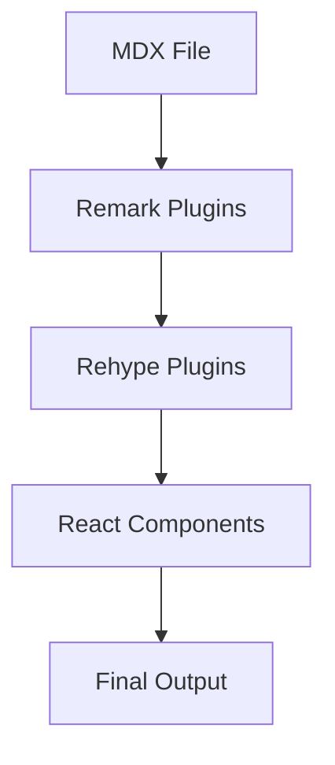

# Step 5: MDX Configuration & Content Processing

## Objective

Configure MDX for enhanced content creation with remark and rehype plugins, enabling features like table of contents generation, automatic heading links, syntax highlighting with Prism.js, and seamless integration with both local MDX files and Contentful content.

## What You'll Learn

- How to configure MDX with Next.js 14 App Router
- How to set up remark plugins for Markdown processing
- How to implement rehype plugins for HTML enhancement
- How to integrate Prism.js for syntax highlighting
- How to generate automatic table of contents
- How to create heading anchors and auto-linking
- How to combine MDX with Contentful content

## Prerequisites

- Completed [Step 4: Contentful CMS Integration](../04-contentful-setup)
- Basic understanding of Markdown and MDX
- Familiarity with remark/rehype plugin ecosystem

## MDX Processing Pipeline

```
MDX Content → remark (Markdown) → rehype (HTML) → React Components
├── remark-gfm (GitHub Flavored Markdown)
├── remark-toc (Table of Contents)
├── rehype-slug (Heading IDs)
├── rehype-autolink-headings (Clickable headings)
├── rehype-prism-plus (Syntax highlighting)
└── Custom components
```

## Step-by-Step Instructions

### 1. Install MDX and Plugin Dependencies

```bash
npm install @next/mdx @mdx-js/loader @mdx-js/react
npm install remark remark-gfm remark-toc remark-math
npm install rehype rehype-slug rehype-autolink-headings rehype-prism-plus
npm install gray-matter reading-time
npm install prismjs
npm install @types/prismjs
```

### 2. Configure Next.js for MDX

Update `next.config.mjs`:

```javascript
import createMDX from "@next/mdx";
import remarkGfm from "remark-gfm";
import remarkToc from "remark-toc";
import rehypeSlug from "rehype-slug";
import rehypeAutolinkHeadings from "rehype-autolink-headings";
import rehypePrismPlus from "rehype-prism-plus";

/** @type {import('next').NextConfig} */
const nextConfig = {
  // Configure `pageExtensions` to include MDX files
  pageExtensions: ["js", "jsx", "mdx", "ts", "tsx"],
  // Experimental features
  experimental: {
    mdxRs: false, // Use the JavaScript-based MDX compiler
  },
  // Image domains for external images
  images: {
    domains: [
      "images.ctfassets.net", // Contentful
      "downloads.ctfassets.net", // Contentful
    ],
  },
};

const withMDX = createMDX({
  // Add markdown plugins here
  options: {
    remarkPlugins: [
      remarkGfm,
      [
        remarkToc,
        {
          heading: "table-of-contents|toc|table of contents",
          maxDepth: 3,
          tight: true,
        },
      ],
    ],
    rehypePlugins: [
      rehypeSlug,
      [
        rehypeAutolinkHeadings,
        {
          behavior: "wrap",
          properties: {
            className: ["anchor-link"],
            ariaLabel: "Link to section",
          },
        },
      ],
      [
        rehypePrismPlus,
        {
          defaultLanguage: "text",
          ignoreMissing: true,
        },
      ],
    ],
  },
});

export default withMDX(nextConfig);
```

### 3. Configure MDX Components

Create `mdx-components.tsx` in the root directory:

```typescript
import type { MDXComponents } from 'mdx/types'
import Image from 'next/image'
import Link from 'next/link'
import { Button } from '@/components/ui/button'
import { Card, CardContent, CardDescription, CardHeader, CardTitle } from '@/components/ui/card'
import { Alert, AlertDescription, AlertTitle } from '@/components/ui/alert'
import { Badge } from '@/components/ui/badge'
import { Separator } from '@/components/ui/separator'
import {
  AlertTriangle,
  Info,
  CheckCircle,
  XCircle,
  Lightbulb,
  Code,
  ExternalLink,
  Hash
} from 'lucide-react'

// Custom components for MDX
const components: MDXComponents = {
  // Override default elements
  h1: ({ children, id }) => (
    <h1
      id={id}
      className="scroll-m-20 text-4xl font-extrabold tracking-tight lg:text-5xl mb-6"
    >
      {children}
    </h1>
  ),
  h2: ({ children, id }) => (
    <h2
      id={id}
      className="scroll-m-20 border-b pb-2 text-3xl font-semibold tracking-tight mb-4 mt-8"
    >
      {children}
    </h2>
  ),
  h3: ({ children, id }) => (
    <h3
      id={id}
      className="scroll-m-20 text-2xl font-semibold tracking-tight mb-3 mt-6"
    >
      {children}
    </h3>
  ),
  h4: ({ children, id }) => (
    <h4
      id={id}
      className="scroll-m-20 text-xl font-semibold tracking-tight mb-2 mt-4"
    >
      {children}
    </h4>
  ),
  h5: ({ children, id }) => (
    <h5
      id={id}
      className="scroll-m-20 text-lg font-semibold tracking-tight mb-2 mt-3"
    >
      {children}
    </h5>
  ),
  h6: ({ children, id }) => (
    <h6
      id={id}
      className="scroll-m-20 text-base font-semibold tracking-tight mb-2 mt-2"
    >
      {children}
    </h6>
  ),
  p: ({ children }) => (
    <p className="leading-7 mb-4">
      {children}
    </p>
  ),
  ul: ({ children }) => (
    <ul className="my-6 ml-6 list-disc [&>li]:mt-2">
      {children}
    </ul>
  ),
  ol: ({ children }) => (
    <ol className="my-6 ml-6 list-decimal [&>li]:mt-2">
      {children}
    </ol>
  ),
  li: ({ children }) => (
    <li className="leading-7">
      {children}
    </li>
  ),
  blockquote: ({ children }) => (
    <blockquote className="mt-6 border-l-2 pl-6 italic text-muted-foreground">
      {children}
    </blockquote>
  ),
  table: ({ children }) => (
    <div className="my-6 w-full overflow-y-auto">
      <table className="w-full border-collapse border border-border">
        {children}
      </table>
    </div>
  ),
  thead: ({ children }) => (
    <thead className="bg-muted/50">
      {children}
    </thead>
  ),
  tbody: ({ children }) => (
    <tbody className="[&_tr:last-child]:border-0">
      {children}
    </tbody>
  ),
  tr: ({ children }) => (
    <tr className="border-b border-border">
      {children}
    </tr>
  ),
  th: ({ children }) => (
    <th className="border border-border px-4 py-2 text-left font-bold">
      {children}
    </th>
  ),
  td: ({ children }) => (
    <td className="border border-border px-4 py-2">
      {children}
    </td>
  ),
  code: ({ children, className }) => {
    const isInline = !className

    if (isInline) {
      return (
        <code className="relative rounded bg-muted px-[0.3rem] py-[0.2rem] font-mono text-sm font-semibold">
          {children}
        </code>
      )
    }

    return (
      <code className={className}>
        {children}
      </code>
    )
  },
  pre: ({ children, ...props }) => (
    <pre
      className="mb-4 mt-6 overflow-x-auto rounded-lg border bg-zinc-950 py-4 dark:bg-zinc-900"
      {...props}
    >
      {children}
    </pre>
  ),
  a: ({ href, children }) => {
    const isExternal = href?.startsWith('http')
    const Component = isExternal ? 'a' : Link

    return (
      <Component
        href={href!}
        className="font-medium text-primary underline underline-offset-4 hover:no-underline inline-flex items-center gap-1"
        {...(isExternal && {
          target: '_blank',
          rel: 'noopener noreferrer'
        })}
      >
        {children}
        {isExternal && <ExternalLink className="h-3 w-3" />}
      </Component>
    )
  },
  img: ({ src, alt, ...props }) => (
    <Image
      src={src!}
      alt={alt || ''}
      width={800}
      height={600}
      className="rounded-lg mx-auto my-6"
      {...props}
    />
  ),
  hr: () => <Separator className="my-8" />,

  // Custom components
  Button,
  Card,
  CardContent,
  CardDescription,
  CardHeader,
  CardTitle,
  Badge,

  // Alert components
  Alert: ({ type = 'info', title, children }: {
    type?: 'info' | 'warning' | 'error' | 'success' | 'tip'
    title?: string
    children: React.ReactNode
  }) => {
    const icons = {
      info: Info,
      warning: AlertTriangle,
      error: XCircle,
      success: CheckCircle,
      tip: Lightbulb,
    }

    const Icon = icons[type]

    return (
      <Alert className="my-6">
        <Icon className="h-4 w-4" />
        {title && <AlertTitle>{title}</AlertTitle>}
        <AlertDescription>
          {children}
        </AlertDescription>
      </Alert>
    )
  },

  // Code block with title
  CodeBlock: ({ title, language, children }: {
    title?: string
    language?: string
    children: React.ReactNode
  }) => (
    <div className="my-6">
      {title && (
        <div className="flex items-center gap-2 rounded-t-lg bg-muted px-4 py-2 border border-b-0">
          <Code className="h-4 w-4" />
          <span className="text-sm font-medium">{title}</span>
          {language && (
            <Badge variant="secondary" className="ml-auto text-xs">
              {language}
            </Badge>
          )}
        </div>
      )}
      <pre className={`${title ? 'rounded-t-none' : 'rounded-lg'} overflow-x-auto border bg-zinc-950 p-4 dark:bg-zinc-900`}>
        <code>{children}</code>
      </pre>
    </div>
  ),

  // Table of Contents
  TOC: ({ children }: { children: React.ReactNode }) => (
    <Card className="my-6">
      <CardHeader>
        <CardTitle className="flex items-center gap-2">
          <Hash className="h-5 w-5" />
          Table of Contents
        </CardTitle>
      </CardHeader>
      <CardContent>
        <div className="prose prose-sm max-w-none">
          {children}
        </div>
      </CardContent>
    </Card>
  ),
}

export function useMDXComponents(components: MDXComponents): MDXComponents {
  return {
    ...components,
  }
}

export default components
```

### 4. Create MDX Utilities

Create `src/lib/mdx-utils.ts`:

````typescript
import fs from "fs";
import path from "path";
import matter from "gray-matter";
import readingTime from "reading-time";
import { remark } from "remark";
import remarkGfm from "remark-gfm";
import remarkToc from "remark-toc";
import { rehype } from "rehype";
import rehypeSlug from "rehype-slug";
import rehypeAutolinkHeadings from "rehype-autolink-headings";

// Types for local MDX posts
export interface MDXPost {
  slug: string;
  title: string;
  description: string;
  date: string;
  author: string;
  tags: string[];
  category: string;
  published: boolean;
  featured?: boolean;
  coverImage?: string;
  readingTime: {
    text: string;
    minutes: number;
    words: number;
  };
  content: string;
}

// Get the posts directory
const postsDirectory = path.join(process.cwd(), "content/posts");

// Ensure posts directory exists
if (!fs.existsSync(postsDirectory)) {
  fs.mkdirSync(postsDirectory, { recursive: true });
}

export function getAllMDXPosts(): MDXPost[] {
  try {
    if (!fs.existsSync(postsDirectory)) {
      return [];
    }

    const fileNames = fs.readdirSync(postsDirectory);
    const allPostsData = fileNames
      .filter((fileName) => fileName.endsWith(".mdx"))
      .map((fileName) => {
        const slug = fileName.replace(/\.mdx$/, "");
        return getMDXPostBySlug(slug);
      })
      .filter((post): post is MDXPost => post !== null)
      .sort((a, b) => new Date(b.date).getTime() - new Date(a.date).getTime());

    return allPostsData;
  } catch (error) {
    console.error("Error reading MDX posts:", error);
    return [];
  }
}

export function getMDXPostBySlug(slug: string): MDXPost | null {
  try {
    const fullPath = path.join(postsDirectory, `${slug}.mdx`);

    if (!fs.existsSync(fullPath)) {
      return null;
    }

    const fileContents = fs.readFileSync(fullPath, "utf8");
    const { data, content } = matter(fileContents);

    // Calculate reading time
    const readingTimeData = readingTime(content);

    return {
      slug,
      title: data.title,
      description: data.description,
      date: data.date,
      author: data.author,
      tags: data.tags || [],
      category: data.category,
      published: data.published ?? true,
      featured: data.featured ?? false,
      coverImage: data.coverImage,
      readingTime: readingTimeData,
      content,
    };
  } catch (error) {
    console.error(`Error reading MDX post ${slug}:`, error);
    return null;
  }
}

export function getPublishedMDXPosts(): MDXPost[] {
  return getAllMDXPosts().filter((post) => post.published);
}

export function getFeaturedMDXPosts(): MDXPost[] {
  return getPublishedMDXPosts().filter((post) => post.featured);
}

export function getMDXPostsByCategory(category: string): MDXPost[] {
  return getPublishedMDXPosts().filter(
    (post) => post.category.toLowerCase() === category.toLowerCase()
  );
}

export function getMDXPostsByTag(tag: string): MDXPost[] {
  return getPublishedMDXPosts().filter((post) =>
    post.tags.some((postTag) => postTag.toLowerCase() === tag.toLowerCase())
  );
}

export function getAllMDXCategories(): string[] {
  const posts = getPublishedMDXPosts();
  const categories = [...new Set(posts.map((post) => post.category))];
  return categories.sort();
}

export function getAllMDXTags(): string[] {
  const posts = getPublishedMDXPosts();
  const tags = [...new Set(posts.flatMap((post) => post.tags))];
  return tags.sort();
}

// Process MDX content with remark/rehype
export async function processMDXContent(content: string): Promise<string> {
  const result = await remark()
    .use(remarkGfm)
    .use(remarkToc, {
      heading: "table-of-contents|toc|table of contents",
      maxDepth: 3,
      tight: true,
    })
    .process(content);

  const htmlResult = await rehype()
    .use(rehypeSlug)
    .use(rehypeAutolinkHeadings, {
      behavior: "wrap",
      properties: {
        className: ["anchor-link"],
        ariaLabel: "Link to section",
      },
    })
    .process(result.toString());

  return htmlResult.toString();
}

// Extract table of contents from MDX content
export function extractTOC(content: string): Array<{
  level: number;
  title: string;
  id: string;
}> {
  const headingRegex = /^(#{1,6})\s+(.+)$/gm;
  const toc: Array<{ level: number; title: string; id: string }> = [];
  let match;

  while ((match = headingRegex.exec(content)) !== null) {
    const level = match[1].length;
    const title = match[2].trim();
    const id = title
      .toLowerCase()
      .replace(/[^a-z0-9]+/g, "-")
      .replace(/(^-|-$)/g, "");

    toc.push({ level, title, id });
  }

  return toc;
}

// Generate excerpt from content
export function generateExcerpt(content: string, length: number = 150): string {
  // Remove MDX/Markdown syntax
  const plainText = content
    .replace(/```[\s\S]*?```/g, "") // Remove code blocks
    .replace(/`[^`]+`/g, "") // Remove inline code
    .replace(/!\[.*?\]\(.*?\)/g, "") // Remove images
    .replace(/\[([^\]]+)\]\([^)]+\)/g, "$1") // Convert links to text
    .replace(/#+\s/g, "") // Remove heading markers
    .replace(/[*_~]/g, "") // Remove emphasis markers
    .replace(/\n/g, " ") // Replace newlines with spaces
    .trim();

  if (plainText.length <= length) {
    return plainText;
  }

  // Find the last complete word within the length limit
  const truncated = plainText.substring(0, length);
  const lastSpaceIndex = truncated.lastIndexOf(" ");

  return lastSpaceIndex > 0
    ? truncated.substring(0, lastSpaceIndex) + "..."
    : truncated + "...";
}
````

### 5. Set Up Prism.js Styling

Create `src/styles/prism.css`:

```css
/* Prism.js syntax highlighting styles */

/* Base styles */
code[class*="language-"],
pre[class*="language-"] {
  color: #f8f8f2;
  background: none;
  text-shadow: 0 1px rgba(0, 0, 0, 0.3);
  font-family:
    "JetBrains Mono", "Fira Code", Consolas, Monaco, "Andale Mono",
    "Ubuntu Mono", monospace;
  font-size: 14px;
  text-align: left;
  white-space: pre;
  word-spacing: normal;
  word-break: normal;
  word-wrap: normal;
  line-height: 1.5;
  tab-size: 4;
  hyphens: none;
}

/* Code blocks */
pre[class*="language-"] {
  padding: 1em;
  margin: 0.5em 0;
  overflow: auto;
  border-radius: 0.3em;
  background: #1e1e1e;
}

/* Inline code */
:not(pre) > code[class*="language-"] {
  padding: 0.1em 0.3em;
  border-radius: 0.3em;
  white-space: normal;
  background: #2d2d2d;
}

/* Tokens */
.token.comment,
.token.prolog,
.token.doctype,
.token.cdata {
  color: #6a9955;
}

.token.punctuation {
  color: #d4d4d4;
}

.token.property,
.token.tag,
.token.constant,
.token.symbol,
.token.deleted {
  color: #f92672;
}

.token.boolean,
.token.number {
  color: #bd93f9;
}

.token.selector,
.token.attr-name,
.token.string,
.token.char,
.token.builtin,
.token.inserted {
  color: #a6e22e;
}

.token.operator,
.token.entity,
.token.url,
.language-css .token.string,
.style .token.string,
.token.variable {
  color: #f8f8f2;
}

.token.atrule,
.token.attr-value,
.token.function,
.token.class-name {
  color: #e6db74;
}

.token.keyword {
  color: #66d9ef;
}

.token.regex,
.token.important {
  color: #fd971f;
}

.token.important,
.token.bold {
  font-weight: bold;
}

.token.italic {
  font-style: italic;
}

.token.entity {
  cursor: help;
}

/* Line highlighting */
.line-highlight {
  background: rgba(255, 255, 255, 0.1);
  border-left: 3px solid #f92672;
  padding-left: 0.75em;
  margin-left: -1em;
}

/* Line numbers */
.line-numbers .line-numbers-rows {
  pointer-events: none;
  position: absolute;
  left: 0;
  font-size: 100%;
  width: 3em;
  letter-spacing: -1px;
  border-right: 1px solid #999;
  user-select: none;
}

.line-numbers .line-numbers-rows > span {
  display: block;
  counter-increment: linenumber;
}

.line-numbers .line-numbers-rows > span:before {
  content: counter(linenumber);
  color: #999;
  display: block;
  padding-right: 0.8em;
  text-align: right;
}

/* Copy button */
.code-toolbar {
  position: relative;
}

.code-toolbar .toolbar {
  position: absolute;
  top: 0.3em;
  right: 0.2em;
  transition: opacity 0.3s ease-in-out;
  opacity: 0;
}

.code-toolbar:hover .toolbar {
  opacity: 1;
}

.code-toolbar .toolbar .toolbar-item {
  display: inline-block;
  margin-right: 0.5em;
}

.code-toolbar .toolbar .toolbar-item button {
  background: #f4f4f4;
  border: 1px solid #ccc;
  border-radius: 0.2em;
  color: #333;
  cursor: pointer;
  font-size: 0.8em;
  padding: 0.2em 0.5em;
}

.code-toolbar .toolbar .toolbar-item button:hover {
  background: #e6e6e6;
}

/* Language badge */
pre[class*="language-"]:before {
  content: attr(data-language);
  position: absolute;
  top: 0;
  right: 0;
  background: rgba(255, 255, 255, 0.1);
  color: #f8f8f2;
  font-size: 0.75rem;
  padding: 0.25rem 0.5rem;
  border-radius: 0 0.3rem 0 0.3rem;
  text-transform: uppercase;
  font-weight: 600;
  letter-spacing: 0.5px;
}

/* Responsive adjustments */
@media (max-width: 768px) {
  code[class*="language-"],
  pre[class*="language-"] {
    font-size: 12px;
  }

  pre[class*="language-"] {
    padding: 0.75em;
    margin: 0.25em 0;
  }
}

/* Dark mode adjustments */
@media (prefers-color-scheme: dark) {
  pre[class*="language-"] {
    background: #0d1117;
    border: 1px solid #30363d;
  }

  :not(pre) > code[class*="language-"] {
    background: #161b22;
    border: 1px solid #30363d;
  }
}
```

Import this in your `src/app/globals.css`:

```css
@import "../styles/prism.css";

/* Add anchor link styles */
.anchor-link {
  text-decoration: none;
  color: inherit;
  position: relative;
}

.anchor-link:hover {
  text-decoration: none;
}

.anchor-link:before {
  content: "#";
  position: absolute;
  left: -1.5rem;
  opacity: 0;
  transition: opacity 0.2s ease;
  color: hsl(var(--muted-foreground));
  font-weight: 500;
}

.anchor-link:hover:before {
  opacity: 1;
}

/* Table of contents styling */
.toc {
  background: hsl(var(--muted) / 0.3);
  border: 1px solid hsl(var(--border));
  border-radius: 0.5rem;
  padding: 1rem;
  margin: 1.5rem 0;
}

.toc ul {
  margin: 0;
  padding-left: 1rem;
  list-style: none;
}

.toc li {
  margin: 0.25rem 0;
}

.toc a {
  color: hsl(var(--foreground));
  text-decoration: none;
  font-size: 0.9rem;
}

.toc a:hover {
  color: hsl(var(--primary));
  text-decoration: underline;
}

/* Smooth scrolling for anchor links */
html {
  scroll-behavior: smooth;
}

/* Scroll margin for headings (to account for fixed headers) */
h1[id],
h2[id],
h3[id],
h4[id],
h5[id],
h6[id] {
  scroll-margin-top: 2rem;
}
```

### 6. Create Sample MDX Posts

Create the content directory and sample posts:

```bash
mkdir -p content/posts
```

Create `content/posts/getting-started-with-mdx.mdx`:

````mdx
---
title: "Getting Started with MDX in Next.js"
description: "Learn how to use MDX for creating rich, interactive blog content with React components"
date: "2024-01-15"
author: "John Doe"
category: "Web Development"
tags: ["MDX", "Next.js", "React", "TypeScript"]
published: true
featured: true
coverImage: "/images/mdx-guide.jpg"
---

# Getting Started with MDX in Next.js

MDX combines the simplicity of Markdown with the power of React components, making it perfect for creating rich, interactive blog content.

## Table of Contents

## What is MDX?

MDX is a format that allows you to write **Markdown** with embedded **React components**. It's perfect for:

- Technical documentation
- Blog posts with interactive examples
- Educational content
- Component libraries documentation

<Alert type="info" title="What you'll learn">
  In this guide, you'll learn how to set up MDX with Next.js, configure plugins,
  and create interactive content.
</Alert>

## Basic Syntax

### Text Formatting

You can use all standard Markdown formatting:

- **Bold text** with `**bold**`
- _Italic text_ with `*italic*`
- `Inline code` with backticks
- ~~Strikethrough~~ with `~~strikethrough~~`

### Lists

Ordered lists:

1. First item
2. Second item
3. Third item

Unordered lists:

- Item one
- Item two
- Item three

### Code Blocks

Here's a TypeScript example:

```typescript
interface BlogPost {
  title: string;
  content: string;
  publishedAt: Date;
}

const createPost = (post: BlogPost): BlogPost => {
  return {
    ...post,
    publishedAt: new Date(),
  };
};
```
````

<CodeBlock title="React Component Example" language="jsx">
  {`function BlogCard({ title, excerpt, author }) {
  return (
    <div className="bg-white rounded-lg shadow-md p-6">
      <h3 className="text-xl font-bold mb-2">{title}</h3>
      <p className="text-gray-600 mb-4">{excerpt}</p>
      <span className="text-sm text-blue-600">By {author}</span>
    </div>
  )
}`}
</CodeBlock>

### Interactive Components

You can embed React components directly in your MDX:

<Card>
  <CardHeader>
    <CardTitle>Interactive Example</CardTitle>
    <CardDescription>
      This is a custom card component embedded in MDX
    </CardDescription>
  </CardHeader>
  <CardContent>
    <Button>Click me!</Button>
  </CardContent>
</Card>

### Alerts and Callouts

<Alert type="warning" title="Important Note">
  Always validate user input before processing it in your application.
</Alert>

<Alert type="success">
  Your MDX setup is working correctly if you can see this green alert!
</Alert>

<Alert type="error" title="Common Mistake">
  Don't forget to add the file extension when importing MDX files.
</Alert>

<Alert type="tip">
  Use TypeScript with MDX for better development experience and type safety.
</Alert>

## Tables

| Feature              | Markdown | MDX | HTML |
| -------------------- | -------- | --- | ---- |
| Text formatting      | ✅       | ✅  | ✅   |
| Code blocks          | ✅       | ✅  | ✅   |
| React components     | ❌       | ✅  | ✅   |
| Interactive elements | ❌       | ✅  | ✅   |

## Advanced Features

### Math Expressions

You can include mathematical expressions using KaTeX (if configured):

```
E = mc²
```

### Diagrams

You can embed diagrams using Mermaid or other diagram libraries:



## Best Practices

1. **Keep components simple**: MDX works best with simple, focused components
2. **Use TypeScript**: Add type safety to your MDX components
3. **Optimize images**: Use Next.js Image component for better performance
4. **Test your content**: Preview your MDX content before publishing

## Next Steps

Now that you understand the basics of MDX, you can:

- Create more complex interactive components
- Set up automatic table of contents generation
- Add syntax highlighting with Prism.js
- Implement content search functionality

<Alert type="info">
  Check out the [official MDX documentation](https://mdxjs.com/) for more
  advanced features and examples.
</Alert>

---

_This post was written in MDX and demonstrates various features available in our blog platform._

````

Create `content/posts/advanced-typescript-patterns.mdx`:

```mdx
---
title: "Advanced TypeScript Patterns for React Development"
description: "Explore advanced TypeScript patterns and techniques for building robust React applications"
date: "2024-01-20"
author: "Jane Smith"
category: "TypeScript"
tags: ["TypeScript", "React", "Patterns", "Advanced"]
published: true
featured: false
coverImage: "/images/typescript-patterns.jpg"
---

# Advanced TypeScript Patterns for React Development

TypeScript has become essential for building large-scale React applications. Let's explore some advanced patterns that will make your code more robust and maintainable.

## Table of Contents

## Generic Components

Generic components allow you to create reusable components that work with different data types:

```typescript
interface DataTableProps<T> {
  data: T[]
  columns: Array<{
    key: keyof T
    header: string
    render?: (value: T[keyof T], item: T) => React.ReactNode
  }>
  onRowClick?: (item: T) => void
}

function DataTable<T extends Record<string, any>>({
  data,
  columns,
  onRowClick
}: DataTableProps<T>) {
  return (
    <table className="w-full border-collapse">
      <thead>
        <tr>
          {columns.map((column) => (
            <th key={String(column.key)} className="border p-2">
              {column.header}
            </th>
          ))}
        </tr>
      </thead>
      <tbody>
        {data.map((item, index) => (
          <tr
            key={index}
            onClick={() => onRowClick?.(item)}
            className="hover:bg-gray-50 cursor-pointer"
          >
            {columns.map((column) => (
              <td key={String(column.key)} className="border p-2">
                {column.render
                  ? column.render(item[column.key], item)
                  : String(item[column.key])
                }
              </td>
            ))}
          </tr>
        ))}
      </tbody>
    </table>
  )
}
````

<Alert type="tip" title="Pro Tip">
Use generic constraints (`T extends Record<string, any>`) to ensure your generic types have the properties you need.
</Alert>

## Conditional Types

Conditional types help create more precise type definitions:

```typescript
// Helper type for form field props
type FormFieldProps<T> = T extends string
  ? { type: "text"; value: string; onChange: (value: string) => void }
  : T extends number
    ? { type: "number"; value: number; onChange: (value: number) => void }
    : T extends boolean
      ? {
          type: "checkbox";
          checked: boolean;
          onChange: (checked: boolean) => void;
        }
      : never;

// Usage in a form component
interface User {
  name: string;
  age: number;
  isActive: boolean;
}

function FormField<K extends keyof User>(
  props: { field: K } & FormFieldProps<User[K]>
) {
  // Component implementation
}
```

## Utility Types for Props

Create utility types to make prop definitions more maintainable:

```typescript
// Base component props
interface BaseComponentProps {
  className?: string
  children?: React.ReactNode
  'data-testid'?: string
}

// Polymorphic component type
type PolymorphicProps<E extends React.ElementType> = {
  as?: E
} & BaseComponentProps &
  Omit<React.ComponentProps<E>, keyof BaseComponentProps | 'as'>

// Polymorphic component
function Box<E extends React.ElementType = 'div'>({
  as,
  children,
  ...props
}: PolymorphicProps<E>) {
  const Component = as || 'div'
  return <Component {...props}>{children}</Component>
}

// Usage
<Box>Default div</Box>
<Box as="section" className="container">Section</Box>
<Box as="button" onClick={() => {}}>Button</Box>
```

## State Management Types

Define precise types for complex state management:

```typescript
// Action types
type Action<T extends string, P = undefined> = P extends undefined
  ? { type: T }
  : { type: T; payload: P };

// Define all possible actions
type UserAction =
  | Action<"FETCH_USER_START">
  | Action<"FETCH_USER_SUCCESS", { user: User }>
  | Action<"FETCH_USER_ERROR", { error: string }>
  | Action<"UPDATE_USER", { updates: Partial<User> }>
  | Action<"RESET_USER">;

// Reducer with exhaustive type checking
function userReducer(state: UserState, action: UserAction): UserState {
  switch (action.type) {
    case "FETCH_USER_START":
      return { ...state, loading: true, error: null };
    case "FETCH_USER_SUCCESS":
      return { ...state, loading: false, user: action.payload.user };
    case "FETCH_USER_ERROR":
      return { ...state, loading: false, error: action.payload.error };
    case "UPDATE_USER":
      return {
        ...state,
        user: state.user ? { ...state.user, ...action.payload.updates } : null,
      };
    case "RESET_USER":
      return initialState;
    default:
      // TypeScript will ensure this is never reached
      return state;
  }
}
```

<Alert type="warning" title="Type Safety">
  Always use discriminated unions for action types to ensure exhaustive checking
  in reducers.
</Alert>

## HOC and Render Props Types

Type higher-order components and render props properly:

```typescript
// HOC type definition
type HOCProps<T> = {
  loading: boolean
  error: string | null
} & T

function withLoading<P extends object>(
  Component: React.ComponentType<P>
): React.ComponentType<P & { isLoading?: boolean }> {
  return function WithLoadingComponent({ isLoading, ...props }) {
    if (isLoading) {
      return <div>Loading...</div>
    }
    return <Component {...(props as P)} />
  }
}

// Render props pattern
interface RenderPropsComponentProps<T> {
  children: (data: T, loading: boolean, error: string | null) => React.ReactNode
  fetch: () => Promise<T>
}

function DataFetcher<T>({ children, fetch }: RenderPropsComponentProps<T>) {
  const [data, setData] = useState<T | null>(null)
  const [loading, setLoading] = useState(false)
  const [error, setError] = useState<string | null>(null)

  // Implementation...

  return <>{children(data as T, loading, error)}</>
}
```

## Custom Hook Types

Create well-typed custom hooks:

```typescript
// Generic hook for API calls
interface UseApiOptions<T> {
  initialData?: T;
  onSuccess?: (data: T) => void;
  onError?: (error: Error) => void;
}

interface UseApiReturn<T> {
  data: T | null;
  loading: boolean;
  error: Error | null;
  refetch: () => Promise<void>;
}

function useApi<T>(
  url: string,
  options: UseApiOptions<T> = {}
): UseApiReturn<T> {
  const [data, setData] = useState<T | null>(options.initialData || null);
  const [loading, setLoading] = useState(false);
  const [error, setError] = useState<Error | null>(null);

  const fetchData = useCallback(async () => {
    setLoading(true);
    setError(null);

    try {
      const response = await fetch(url);
      if (!response.ok) throw new Error("Failed to fetch");

      const result = await response.json();
      setData(result);
      options.onSuccess?.(result);
    } catch (err) {
      const error = err instanceof Error ? err : new Error("Unknown error");
      setError(error);
      options.onError?.(error);
    } finally {
      setLoading(false);
    }
  }, [url, options]);

  useEffect(() => {
    fetchData();
  }, [fetchData]);

  return { data, loading, error, refetch: fetchData };
}
```

## Conclusion

These advanced TypeScript patterns help create more robust, maintainable React applications:

1. **Generic components** for reusability
2. **Conditional types** for precise type definitions
3. **Utility types** for cleaner prop definitions
4. **Discriminated unions** for state management
5. **Proper HOC typing** for component composition
6. **Well-typed hooks** for logic reuse

<Alert type="success">
  Master these patterns to write more confident, bug-free TypeScript code!
</Alert>

---

_Keep exploring TypeScript's type system – there's always more to learn!_

````

### 7. Create MDX Blog Pages

Create `src/app/blog/mdx/[slug]/page.tsx`:

```typescript
import { notFound } from 'next/navigation'
import { getMDXPostBySlug, getAllMDXPosts } from '@/lib/mdx-utils'
import { Badge } from '@/components/ui/badge'
import { CalendarDays, Clock, User } from 'lucide-react'
import { format } from 'date-fns'
import Image from 'next/image'
import { MDXRemote } from 'next-mdx-remote/rsc'
import components from '../../../../mdx-components'

interface MDXBlogPostPageProps {
  params: {
    slug: string
  }
}

export default async function MDXBlogPostPage({ params }: MDXBlogPostPageProps) {
  const post = getMDXPostBySlug(params.slug)

  if (!post || !post.published) {
    notFound()
  }

  return (
    <article className="container mx-auto py-8 max-w-4xl">
      {/* Cover Image */}
      {post.coverImage && (
        <div className="relative w-full h-96 mb-8 rounded-lg overflow-hidden">
          <Image
            src={post.coverImage}
            alt={post.title}
            fill
            className="object-cover"
            priority
          />
        </div>
      )}

      {/* Article Header */}
      <header className="mb-8">
        <div className="flex items-center gap-2 mb-4">
          <Badge variant="outline">{post.category}</Badge>
          {post.tags.map((tag) => (
            <Badge key={tag} variant="secondary">
              {tag}
            </Badge>
          ))}
          {post.featured && <Badge variant="default">Featured</Badge>}
        </div>

        <h1 className="text-4xl font-bold mb-4">{post.title}</h1>

        <p className="text-xl text-muted-foreground mb-6">{post.description}</p>

        {/* Author Info */}
        <div className="flex items-center justify-between">
          <div className="flex items-center gap-4">
            <div className="flex items-center gap-2">
              <User className="h-5 w-5" />
              <span className="font-semibold">{post.author}</span>
            </div>
          </div>

          <div className="flex items-center gap-4 text-sm text-muted-foreground">
            <div className="flex items-center gap-1">
              <CalendarDays className="h-4 w-4" />
              <time dateTime={post.date}>
                {format(new Date(post.date), 'MMMM d, yyyy')}
              </time>
            </div>
            <div className="flex items-center gap-1">
              <Clock className="h-4 w-4" />
              <span>{post.readingTime.text}</span>
            </div>
          </div>
        </div>
      </header>

      {/* Article Content */}
      <div className="prose prose-lg max-w-none">
        <MDXRemote source={post.content} components={components} />
      </div>
    </article>
  )
}

export async function generateStaticParams() {
  const posts = getAllMDXPosts()

  return posts
    .filter(post => post.published)
    .map((post) => ({
      slug: post.slug,
    }))
}

export async function generateMetadata({ params }: MDXBlogPostPageProps) {
  const post = getMDXPostBySlug(params.slug)

  if (!post) {
    return {}
  }

  return {
    title: post.title,
    description: post.description,
    keywords: post.tags,
    openGraph: {
      title: post.title,
      description: post.description,
      images: post.coverImage ? [post.coverImage] : undefined,
      type: 'article',
      publishedTime: post.date,
      authors: [post.author],
    },
    twitter: {
      card: 'summary_large_image',
      title: post.title,
      description: post.description,
      images: post.coverImage ? [post.coverImage] : undefined,
    },
  }
}
````

### 8. Create Table of Contents Component

Create `src/components/mdx/table-of-contents.tsx`:

```typescript
'use client'

import { useEffect, useState } from 'react'
import { Card, CardContent, CardHeader, CardTitle } from '@/components/ui/card'
import { Hash } from 'lucide-react'
import { cn } from '@/lib/utils'

interface TOCItem {
  id: string
  title: string
  level: number
}

interface TableOfContentsProps {
  className?: string
}

export function TableOfContents({ className }: TableOfContentsProps) {
  const [toc, setToc] = useState<TOCItem[]>([])
  const [activeId, setActiveId] = useState<string>('')

  useEffect(() => {
    // Extract headings from the page
    const headings = Array.from(document.querySelectorAll('h1, h2, h3, h4, h5, h6'))
      .filter(heading => heading.id)
      .map(heading => ({
        id: heading.id,
        title: heading.textContent || '',
        level: parseInt(heading.tagName[1]),
      }))

    setToc(headings)

    // Set up intersection observer for active heading
    const observer = new IntersectionObserver(
      (entries) => {
        entries.forEach((entry) => {
          if (entry.isIntersecting) {
            setActiveId(entry.target.id)
          }
        })
      },
      {
        rootMargin: '-100px 0px -66%',
        threshold: 0,
      }
    )

    headings.forEach(({ id }) => {
      const element = document.getElementById(id)
      if (element) observer.observe(element)
    })

    return () => observer.disconnect()
  }, [])

  if (toc.length === 0) {
    return null
  }

  return (
    <Card className={cn('sticky top-4', className)}>
      <CardHeader className="pb-3">
        <CardTitle className="flex items-center gap-2 text-base">
          <Hash className="h-4 w-4" />
          Table of Contents
        </CardTitle>
      </CardHeader>
      <CardContent>
        <nav>
          <ul className="space-y-1">
            {toc.map((item) => (
              <li key={item.id}>
                <a
                  href={`#${item.id}`}
                  className={cn(
                    'block text-sm transition-colors hover:text-primary',
                    'py-1 px-2 rounded-sm',
                    item.level === 2 && 'pl-4',
                    item.level === 3 && 'pl-6',
                    item.level === 4 && 'pl-8',
                    item.level === 5 && 'pl-10',
                    item.level === 6 && 'pl-12',
                    activeId === item.id
                      ? 'text-primary bg-primary/10 font-medium'
                      : 'text-muted-foreground'
                  )}
                >
                  {item.title}
                </a>
              </li>
            ))}
          </ul>
        </nav>
      </CardContent>
    </Card>
  )
}
```

### 9. Create MDX Blog Listing Page

Create `src/app/blog/mdx/page.tsx`:

```typescript
import Link from 'next/link'
import { getAllMDXPosts, getAllMDXCategories, getAllMDXTags } from '@/lib/mdx-utils'
import { Card, CardContent, CardFooter, CardHeader } from '@/components/ui/card'
import { Badge } from '@/components/ui/badge'
import { CalendarDays, Clock, User } from 'lucide-react'
import { format } from 'date-fns'
import Image from 'next/image'

export default function MDXBlogPage() {
  const posts = getAllMDXPosts().filter(post => post.published)
  const categories = getAllMDXCategories()
  const tags = getAllMDXTags()

  return (
    <div className="container mx-auto py-8">
      <div className="mb-8">
        <h1 className="text-4xl font-bold mb-4">MDX Blog Posts</h1>
        <p className="text-xl text-muted-foreground">
          Explore our collection of MDX-powered blog posts with interactive content.
        </p>
      </div>

      {/* Filter Tags */}
      <div className="mb-8">
        <h2 className="text-lg font-semibold mb-3">Categories</h2>
        <div className="flex gap-2 flex-wrap">
          {categories.map((category) => (
            <Badge key={category} variant="outline">
              {category}
            </Badge>
          ))}
        </div>
      </div>

      <div className="mb-8">
        <h2 className="text-lg font-semibold mb-3">Tags</h2>
        <div className="flex gap-2 flex-wrap">
          {tags.map((tag) => (
            <Badge key={tag} variant="secondary">
              {tag}
            </Badge>
          ))}
        </div>
      </div>

      {/* Posts Grid */}
      <div className="grid grid-cols-1 md:grid-cols-2 lg:grid-cols-3 gap-6">
        {posts.map((post) => (
          <Card key={post.slug} className="overflow-hidden hover:shadow-lg transition-shadow">
            {post.coverImage && (
              <div className="relative h-48 overflow-hidden">
                <Image
                  src={post.coverImage}
                  alt={post.title}
                  fill
                  className="object-cover hover:scale-105 transition-transform duration-300"
                />
                {post.featured && (
                  <Badge className="absolute top-4 left-4" variant="secondary">
                    Featured
                  </Badge>
                )}
              </div>
            )}

            <CardHeader className="pb-2">
              <div className="flex items-center gap-2 mb-2">
                <Badge variant="outline">{post.category}</Badge>
                {post.tags.slice(0, 2).map((tag) => (
                  <Badge key={tag} variant="secondary" className="text-xs">
                    {tag}
                  </Badge>
                ))}
              </div>

              <Link href={`/blog/mdx/${post.slug}`}>
                <h3 className="text-xl font-bold hover:text-primary transition-colors">
                  {post.title}
                </h3>
              </Link>
            </CardHeader>

            <CardContent className="pb-2">
              <p className="text-muted-foreground text-sm line-clamp-3">
                {post.description}
              </p>
            </CardContent>

            <CardFooter className="flex items-center justify-between pt-2">
              <div className="flex items-center gap-2">
                <User className="h-4 w-4 text-muted-foreground" />
                <span className="text-sm font-medium">{post.author}</span>
              </div>

              <div className="flex items-center gap-4 text-xs text-muted-foreground">
                <div className="flex items-center gap-1">
                  <CalendarDays className="h-3 w-3" />
                  <time dateTime={post.date}>
                    {format(new Date(post.date), 'MMM d, yyyy')}
                  </time>
                </div>
                <div className="flex items-center gap-1">
                  <Clock className="h-3 w-3" />
                  <span>{post.readingTime.text}</span>
                </div>
              </div>
            </CardFooter>
          </Card>
        ))}
      </div>

      {posts.length === 0 && (
        <div className="text-center py-12">
          <p className="text-muted-foreground">No MDX posts found.</p>
        </div>
      )}
    </div>
  )
}
```

### 10. Test Your MDX Setup

Create a test page to verify everything works:

```bash
npm run dev
```

Visit these URLs to test:

- `/blog/mdx` - MDX blog listing
- `/blog/mdx/getting-started-with-mdx` - Sample MDX post
- `/blog/mdx/advanced-typescript-patterns` - Another sample post

## Advanced MDX Features

### Custom Code Block Component

You can create more sophisticated code blocks:

```typescript
// src/components/mdx/code-block.tsx
'use client'

import { useState } from 'react'
import { Button } from '@/components/ui/button'
import { Copy, Check } from 'lucide-react'

interface CodeBlockProps {
  children: string
  language?: string
  title?: string
  showLineNumbers?: boolean
}

export function CodeBlock({
  children,
  language,
  title,
  showLineNumbers = false
}: CodeBlockProps) {
  const [copied, setCopied] = useState(false)

  const copyToClipboard = async () => {
    await navigator.clipboard.writeText(children)
    setCopied(true)
    setTimeout(() => setCopied(false), 2000)
  }

  return (
    <div className="relative group">
      {title && (
        <div className="bg-muted px-4 py-2 text-sm font-medium border-b">
          {title}
        </div>
      )}

      <Button
        size="sm"
        variant="ghost"
        className="absolute top-2 right-2 opacity-0 group-hover:opacity-100 transition-opacity"
        onClick={copyToClipboard}
      >
        {copied ? <Check className="h-4 w-4" /> : <Copy className="h-4 w-4" />}
      </Button>

      <pre className={`language-${language} ${showLineNumbers ? 'line-numbers' : ''}`}>
        <code>{children}</code>
      </pre>
    </div>
  )
}
```

## Performance Optimization

### Bundle Splitting

Configure Next.js to split MDX content:

```javascript
// next.config.mjs
const nextConfig = {
  experimental: {
    optimizePackageImports: ["@mdx-js/react"],
  },
  webpack: (config) => {
    config.optimization.splitChunks.cacheGroups.mdx = {
      name: "mdx",
      test: /\.mdx$/,
      chunks: "all",
      priority: 10,
    };
    return config;
  },
};
```

### Image Optimization

Optimize images in MDX:

```typescript
// Custom Image component for MDX
const OptimizedImage = ({ src, alt, ...props }) => (
  <Image
    src={src}
    alt={alt}
    width={800}
    height={600}
    className="rounded-lg mx-auto"
    placeholder="blur"
    blurDataURL="data:image/jpeg;base64,/9j/4AAQSkZJRgABAQAAAQABAAD/2wBDAAYEBQYFBAYGBQYHBwYIChAKCgkJChQODwwQFxQYGBcUFhYaHSUfGhsjHBYWICwgIyYnKSopGR8tMC0oMCUoKSj/2wBDAQcHBwoIChMKChMoGhYaKCgoKCgoKCgoKCgoKCgoKCgoKCgoKCgoKCgoKCgoKCgoKCgoKCgoKCgoKCgoKCgoKCj/wAARCAABAAEDASIAAhEBAxEB/8QAFQABAQAAAAAAAAAAAAAAAAAAAAv/xAAUEAEAAAAAAAAAAAAAAAAAAAAA/8QAFQEBAQAAAAAAAAAAAAAAAAAAAAX/xAAUEQEAAAAAAAAAAAAAAAAAAAAA/9oADAMBAAIRAxEAPwCdABmX/9k="
    {...props}
  />
)
```

## Troubleshooting

### Common Issues

1. **MDX not rendering components**
   - Check that components are properly exported from `mdx-components.tsx`
   - Verify component names match exactly

2. **Syntax highlighting not working**
   - Ensure Prism.js CSS is imported
   - Check that rehype-prism-plus is configured correctly

3. **Table of contents not generating**
   - Verify headings have proper markdown syntax
   - Check that remark-toc is configured with correct heading pattern

4. **Build errors with MDX**
   - Check for syntax errors in MDX files
   - Verify all imports in MDX components are valid

## Next Steps

Your MDX configuration is now complete! You should have:

1. ✅ MDX configured with Next.js App Router
2. ✅ Remark and rehype plugins for enhanced processing
3. ✅ Syntax highlighting with Prism.js
4. ✅ Automatic table of contents generation
5. ✅ Heading anchors and auto-linking
6. ✅ Custom MDX components
7. ✅ Local MDX file support alongside Contentful

**Continue to**: [Step 6: UI Components & Styling →](../06-ui-components)

## Additional Resources

- [MDX Documentation](https://mdxjs.com/)
- [Remark Plugin Ecosystem](https://github.com/remarkjs/remark/blob/main/doc/plugins.md)
- [Rehype Plugin Ecosystem](https://github.com/rehypejs/rehype/blob/main/doc/plugins.md)
- [Prism.js Documentation](https://prismjs.com/)

---

**Estimated Time**: 75-90 minutes

**Difficulty**: Intermediate

**Next**: [UI Components & Styling →](../06-ui-components)
